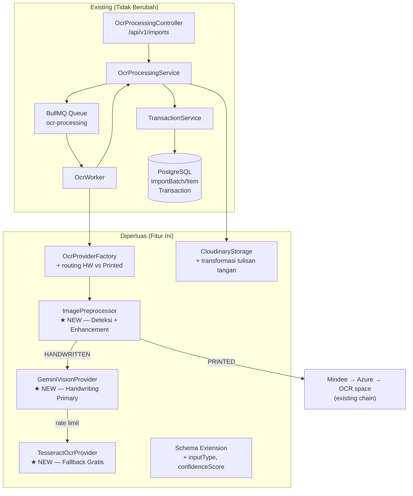
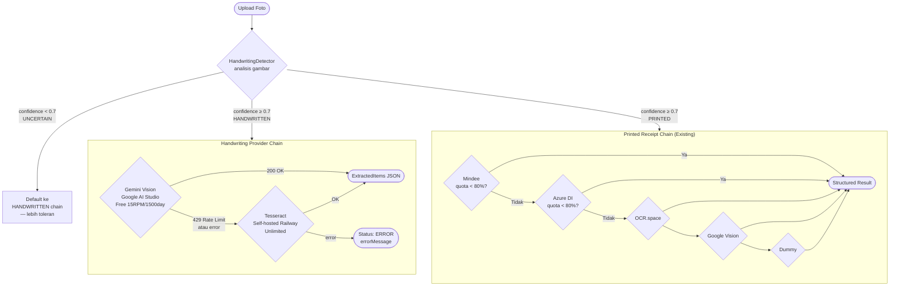
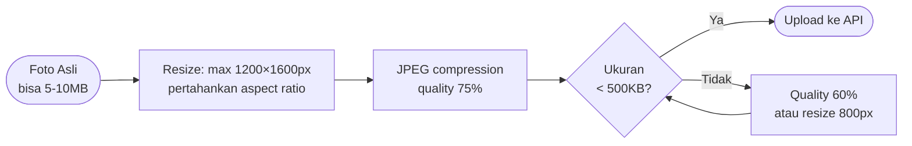
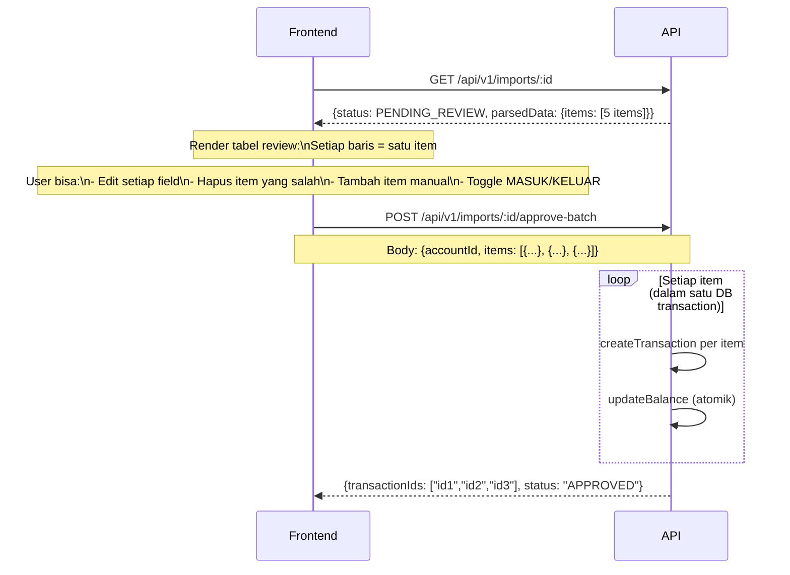
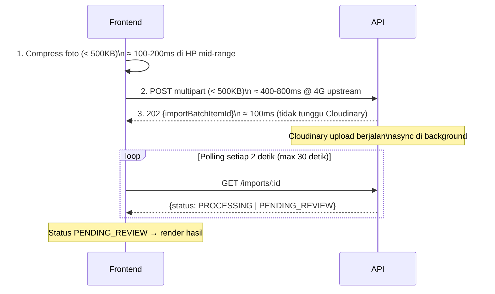
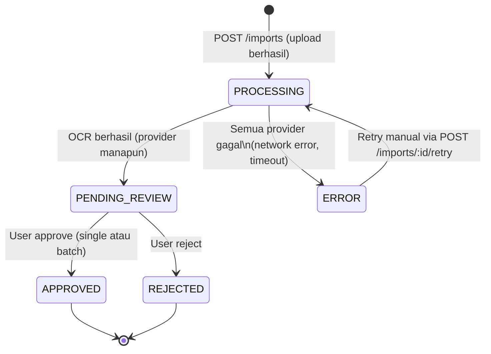

# Design Document: Handwritten Receipt Scanning (OCR Tulisan Tangan UMKM)

| | |
|---|---|
| **Fitur** | `handwritten-ocr-scan` |
| **Tipe** | High-Level Design (Diagrams & Interfaces) |
| **Workflow** | Design-First |
| **Versi** | 1.0 |
| **Tanggal** | 2026-08-20 |
| **Status** | Draft |

---

## Daftar Isi

1. [Overview](#overview)
2. [Architecture](#architecture)
3. [Data Flow — Dari Foto HP ke Transaksi](#3-data-flow--dari-foto-hp-ke-transaksi)
4. [Provider Architecture](#4-provider-architecture)
5. [Image Preprocessing Strategy](#5-image-preprocessing-strategy)
6. [Multi-Transaction Extraction](#6-multi-transaction-extraction)
7. [Database Schema Changes](#7-database-schema-changes)
8. [Components and Interfaces](#components-and-interfaces)
9. [Data Models](#data-models)
10. [API Contract](#10-api-contract)
11. [Performance Optimizations](#11-performance-optimizations)
12. [Free Tier Capacity Planning](#12-free-tier-capacity-planning)
13. [Error Handling](#error-handling)
14. [Security](#14-security)
15. [Testing Strategy](#testing-strategy)
16. [Correctness Properties](#correctness-properties)

---

## Overview

Fitur ini memperluas modul `ocr-processing` yang sudah ada untuk mendukung **tulisan tangan UMKM** — buku catatan, nota manual, kwitansi tangan. Sebelumnya hanya ada `DummyOcrProvider`; fitur ini menambahkan `GeminiVisionProvider` sebagai provider utama khusus tulisan tangan, dengan routing otomatis antara handwriting vs printed receipt.

### Posisi dalam Arsitektur

Fitur ini **tidak** membuat modul baru. Ia bekerja sepenuhnya di dalam modul `ocr-processing` yang ada, dengan memperluas:
- `OcrProvider` interface → tambahkan field metadata
- `NormalizedReceiptResult` → tambahkan `extractedItems[]` untuk multi-transaksi
- `OcrProviderFactory` → tambahkan routing handwriting vs printed
- `ImportBatchItem` schema → tambahkan `inputType`, `confidenceScore`, `itemsCount`

Prinsip non-negosiabel tetap berlaku:
- Hasil OCR **wajib** direview manusia — tidak ada auto-commit ke `Transaction`
- `businessId` di semua data
- Semua uang tetap `Decimal`
- Tidak ada business logic di controller

### Fit ke Arsitektur yang Ada



---

## Architecture

### Komponen Baru dan Relasi

---

## Components and Interfaces

### Deskripsi Komponen Baru

| Komponen | File | Tanggung Jawab |
|---|---|---|
| `GeminiVisionProvider` | `providers/gemini-vision.provider.ts` | Panggil Gemini API dengan prompt terstruktur, parse JSON response → `NormalizedReceiptResult[]` |
| `TesseractOcrProvider` | `providers/tesseract-ocr.provider.ts` | Fallback self-hosted, panggil Tesseract via HTTP ke worker endpoint Railway atau via child_process lokal |
| `HandwritingDetector` | `preprocessing/handwriting-detector.ts` | Analisis gambar → tentukan `InputType.HANDWRITTEN` atau `PRINTED` |
| `ImageEnhancer` | `preprocessing/image-enhancer.ts` | Terapkan Cloudinary transformation chain yang tepat per `InputType` |
| `MultiTransactionParser` | `parsing/multi-transaction-parser.ts` | Urai array JSON dari Gemini → `ExtractedTransactionItem[]` |
| `ParsedItemValidator` | `parsing/parsed-item-validator.ts` | Validasi setiap item: amount positif, tanggal valid, type valid |

---

## Data Models

### ExtractedTransactionItem

```typescript
interface ExtractedTransactionItem {
  date?: string;           // ISO 8601, bisa null kalau tidak terbaca
  description: string;     // nama item / keterangan
  amount: string;          // string Decimal — bukan number, hindari floating point
  type: 'MASUK' | 'KELUAR' | null;  // inferred dari konteks
  confidence: number;      // 0.0 - 1.0 per item
  rawText?: string;        // teks asli sebelum parsing
}
```

**Validation Rules:**
- `amount` harus dapat dikonversi ke `Decimal` positif
- `date` harus ISO 8601 valid atau `null`
- `confidence` harus dalam range 0.0–1.0
- `description` maksimum 255 karakter

### NormalizedReceiptResult (Extended)

```typescript
// Extension backward-compatible dari interface yang sudah ada
interface NormalizedReceiptResult {
  // === FIELDS EXISTING (tidak berubah) ===
  merchantName?: string;
  totalAmount?: number;
  date?: string;
  rawText?: string;
  confidence: number;
  // === FIELDS BARU ===
  items?: ExtractedTransactionItem[];           // untuk multi-transaksi
  inputType?: 'HANDWRITTEN' | 'PRINTED' | 'UNCERTAIN';
  extractionMode?: 'SINGLE' | 'MULTI';
}
```

### DetectionResult

```typescript
interface DetectionResult {
  inputType: 'HANDWRITTEN' | 'PRINTED' | 'UNCERTAIN';
  confidence: number;   // 0.0 - 1.0
  signals: string[];    // ['low_sharp_edges', 'irregular_baseline'] — untuk debugging
}
```

### ApproveBatchDto

```typescript
interface ApproveBatchDto {
  accountId: string;               // akun default untuk semua item
  items: ApproveBatchItemDto[];
}

interface ApproveBatchItemDto {
  index: number;             // index dari parsedData.items[] — untuk audit trail
  accountId?: string;        // override per-item jika beda akun
  type: 'MASUK' | 'KELUAR';
  amount: string;            // Decimal as string, wajib positif
  currency: string;          // ISO 4217, default IDR
  occurredAt: string;        // ISO 8601
  description?: string;
  categoryId?: string;
}
```

**Validation Rules:**
- `amount` harus string angka positif, bisa dikonversi ke Decimal
- `currency` harus dalam whitelist `SUPPORTED_CURRENCIES`
- `occurredAt` harus tanggal valid, tidak boleh masa depan
- TRANSFER tidak didukung dari OCR

---

## 3. Data Flow — Dari Foto HP ke Transaksi

### Alur Lengkap

```mermaid
sequenceDiagram
    participant HP as HP UMKM
    participant FE as Frontend (Next.js)
    participant API as OcrProcessingController
    participant SVC as OcrProcessingService
    participant CLD as Cloudinary
    participant Q as BullMQ Queue
    participant W as OcrWorker
    participant DET as HandwritingDetector
    participant ENH as ImageEnhancer
    participant GEM as GeminiVisionProvider
    participant TES as TesseractProvider (Fallback)
    participant PAR as MultiTransactionParser
    participant DB as PostgreSQL

    Note over HP,FE: CLIENT-SIDE PREPROCESSING
    HP->>FE: Ambil foto (kamera atau galeri)
    FE->>FE: Compress: resize max 1200px, JPEG quality 75%
    FE->>FE: Validasi: ukuran < 500KB, format JPEG/PNG
    Note over FE: Target upload < 3 detik @ 4G 10Mbps

    FE->>API: POST /api/v1/imports (multipart, file + hint?)
    API->>API: Validasi: maxSize 2MB, fileType JPEG/PNG
    API->>SVC: processImportRequest(businessId, buffer, filename)

    Note over SVC,CLD: SERVER-SIDE UPLOAD + ENHANCE
    SVC->>CLD: Upload + Cloudinary transformation\n(deskew, contrast, binarization)
    CLD-->>SVC: imageUrl (enhanced) + originalUrl
    SVC->>DB: INSERT ImportBatch + ImportBatchItem\n(status: PROCESSING)
    SVC->>Q: Enqueue job {itemId, imageUrl, originalUrl}
    SVC-->>API: 202 Accepted {importBatchItemId}
    API-->>FE: 202 {importBatchItemId}

    Note over FE: Polling GET /imports/:id setiap 2 detik
    Note over W,DB: BACKGROUND PROCESSING

    Q->>W: Job diambil
    W->>DET: detect(imageBuffer) → InputType
    DET-->>W: HANDWRITTEN | PRINTED

    alt HANDWRITTEN
        W->>ENH: enhance(imageBuffer, HANDWRITTEN)\n(Cloudinary: grayscale, sharpen, contrast)
        ENH-->>W: enhancedBuffer
        W->>GEM: extractReceipt(enhancedBuffer)
        Note over GEM: Gemini prompt terstruktur\nJSON output multi-transaksi
        GEM-->>W: ExtractedTransactionItem[]
        Note over W,GEM: Jika Gemini rate limit (429)
        W->>TES: extractReceipt(enhancedBuffer)
        TES-->>W: NormalizedReceiptResult
    else PRINTED
        W->>ENH: enhance(imageBuffer, PRINTED)
        ENH-->>W: enhancedBuffer
        W->>W: existing chain\n(Mindee→Azure→OCR.space→GoogleVision→Dummy)
    end

    W->>PAR: parse(rawResult) → ExtractedTransactionItem[]
    PAR-->>W: items[]

    W->>DB: UPDATE ImportBatchItem\n(status: PENDING_REVIEW\nparsedData: {items[]}\nconfidenceScore, inputType\nproviderUsed, itemsCount)

    Note over FE,DB: USER REVIEW
    FE->>API: GET /api/v1/imports/:id
    API-->>FE: {status: PENDING_REVIEW, parsedData: {items[]}}
    FE->>FE: Tampilkan review UI per item
    FE->>FE: User edit/koreksi tiap item
    FE->>API: POST /api/v1/imports/:id/approve-batch\n{items: [{...}, {...}]}

    Note over API,DB: ATOMIC COMMIT
    API->>SVC: approveBatch(id, items[], userId, businessId)
    loop Setiap item yang diapprove
        SVC->>DB: BEGIN TRANSACTION
        SVC->>DB: INSERT Transaction\n(sourceType: IMPORT_OCR)
        SVC->>DB: UPDATE Account.balance (row lock)
        SVC->>DB: INSERT AuditLog
        SVC->>DB: COMMIT
    end
    SVC->>DB: UPDATE ImportBatchItem\n(status: APPROVED, transactionIds[])
    SVC-->>API: {transactionIds[], status: APPROVED}
    API-->>FE: 200 {transactionIds[]}
```

---

## 4. Provider Architecture

### Routing Logic: Handwriting vs Printed



### Interface Extension

```typescript
// Extension dari NormalizedReceiptResult yang sudah ada
interface ExtractedTransactionItem {
  date?: string;           // ISO 8601, bisa null kalau tidak terbaca
  description: string;     // nama item / keterangan
  amount: string;          // string Decimal — bukan number, hindari floating point
  type: 'MASUK' | 'KELUAR' | null;  // inferred dari konteks
  confidence: number;      // 0.0 - 1.0 per item
  rawText?: string;        // teks asli sebelum parsing
}

// NormalizedReceiptResult diperluas (backward-compatible)
interface NormalizedReceiptResult {
  merchantName?: string;
  totalAmount?: number;    // tetap untuk single receipt (backward compat)
  date?: string;
  rawText?: string;
  confidence: number;
  // === FIELDS BARU ===
  items?: ExtractedTransactionItem[];  // untuk multi-transaksi
  inputType?: 'HANDWRITTEN' | 'PRINTED' | 'UNCERTAIN';
  extractionMode?: 'SINGLE' | 'MULTI';  // apakah ini satu transaksi atau banyak
}
```

### Gemini Vision Prompt Strategy

Prompt dirancang untuk output JSON yang deterministik dan mendukung Bahasa Indonesia:

```
Kamu adalah asisten ekstraksi data keuangan UMKM Indonesia.
Analisis foto ini dan ekstrak SEMUA transaksi yang tertulis.

Foto bisa berupa:
- Satu nota/kwitansi (satu transaksi)
- Halaman buku catatan (banyak transaksi)
- Struk toko (satu transaksi)

Kembalikan HANYA JSON valid dengan format berikut:
{
  "inputType": "HANDWRITTEN" | "PRINTED",
  "extractionMode": "SINGLE" | "MULTI",
  "items": [
    {
      "date": "YYYY-MM-DD atau null",
      "description": "deskripsi singkat item/transaksi",
      "amount": "angka dalam Rupiah, tanpa titik/koma (contoh: 75000)",
      "type": "MASUK" | "KELUAR" | null,
      "confidence": 0.0-1.0,
      "rawText": "teks asli dari foto"
    }
  ]
}

Aturan penting:
- "beras 5kg = 75rb" → amount: "75000", description: "beras 5kg", type: "KELUAR"
- Jika ada "terima dari" atau "bayar dari" → MASUK
- Jika ada "beli" atau "bayar untuk" → KELUAR
- Kalau tidak yakin type, tulis null
- amount SELALU dalam integer string (tanpa desimal)
- confidence per item, bukan total
```

---

## 5. Image Preprocessing Strategy

### Client-Side (Frontend/Mobile)

Tujuan: kurangi ukuran file sebelum upload agar cepat di koneksi 4G Indonesia.



**Target:**
- Resolusi: 1200px (lebar) maksimum — cukup untuk Gemini Vision
- Format output: JPEG (bukan PNG — lebih kecil untuk foto)
- Ukuran target: < 500KB
- Estimasi waktu upload @ 4G 10Mbps: `500KB / 1.25MB/s ≈ 0.4 detik` — jauh di bawah target 3 detik

**Library yang direkomendasikan (frontend):**
- Browser: `browser-image-compression` (NPM, zero-dependency)
- React Native: `expo-image-manipulator` atau `react-native-image-resizer`

### Server-Side (Cloudinary Transformation)

Cloudinary diterapkan sebagai enhancement layer setelah upload, berbeda per `InputType`.

| Transformation | HANDWRITTEN | PRINTED |
|---|---|---|
| Grayscale | ✅ `e_grayscale` | ✅ `e_grayscale` |
| Auto-contrast | ✅ `e_improve:50` | ✅ `e_improve:20` |
| Sharpen | ✅ `e_sharpen:80` | ✅ `e_sharpen:40` |
| Deskew | ✅ `a_auto` (auto-rotate) | ✅ `a_auto` |
| Binarization | ✅ `e_blackwhite:50` | ❌ (warna penting untuk printed) |
| Denoise | ✅ `e_noise:15` | ❌ |
| Resize untuk OCR | `w_1200,c_limit` | `w_1600,c_limit` |

**Cara implementasi di Cloudinary URL:**
```
Upload biasa → dapat `imageUrl`
Request enhanced URL:
https://res.cloudinary.com/{cloud}/image/upload/
  e_grayscale,e_improve:50,e_sharpen:80,a_auto,e_blackwhite:50,w_1200,c_limit/
  {public_id}
```

`CloudinaryStorageService` perlu mengembalikan dua URL: `originalUrl` dan `enhancedUrl(inputType)`.

### HandwritingDetector — Heuristik Ringan

Deteksi ringan tanpa model ML tambahan — cukup untuk routing yang akurat:

```typescript
interface DetectionResult {
  inputType: 'HANDWRITTEN' | 'PRINTED' | 'UNCERTAIN';
  confidence: number;
  signals: string[];  // untuk debugging: ['low_sharp_edges', 'irregular_baseline']
}
```

**Sinyal yang diperiksa (dalam urutan biaya komputasi rendah ke tinggi):**

1. **EXIF metadata** — kamera HP → kemungkinan besar foto nota tangan
2. **Aspect ratio** — portrait (A5/A4) dengan margin besar → buku catatan
3. **Color entropy** — foto tulisan tangan = rendah, struk tercetak = sedang
4. **Hint dari frontend** — `X-Hint-Input-Type: handwritten` header opsional dari user

Jika confidence < 0.7 → default ke `HANDWRITTEN` (lebih aman: Gemini lebih toleran dari Mindee untuk semua jenis tulisan).

---

## 6. Multi-Transaction Extraction

### Problem Statement

Skenario utama UMKM: satu foto = halaman buku catatan = 5-15 entri. Arsitektur saat ini hanya menangani satu `ImportBatchItem` = satu `Transaction`. Perlu ekstensi agar satu item bisa menghasilkan multiple transactions saat approve.

### Model Data Multi-Transaksi

```
ImportBatchItem
  ├── parsedData: {
  │     items: ExtractedTransactionItem[]  // array JSON
  │     extractionMode: 'SINGLE' | 'MULTI'
  │     rawText: string
  │   }
  ├── inputType: HANDWRITTEN | PRINTED
  ├── itemsCount: Int               // jumlah item yang diekstrak
  └── confidenceScore: Decimal(4,3) // rata-rata confidence semua item

ApprovedTransaction[]             // new: bisa >1 per ImportBatchItem
  └── (via new ImportBatchApprovedTransaction join table)
```

### Review UI Flow untuk Multi-Transaksi



### Endpoint Baru: `approve-batch`

Endpoint existing `PATCH /imports/:id/approve` tetap ada (backward-compatible untuk single item). Endpoint baru `POST /imports/:id/approve-batch` menangani multiple items dalam satu request.

---

## 7. Database Schema Changes

### Perubahan pada `ImportBatchItem`

```prisma
// TAMBAHAN field (migrasi additive — backward compatible)
model ImportBatchItem {
  // ... field existing tidak berubah ...
  
  // === FIELDS BARU ===
  inputType       InputType?   // HANDWRITTEN | PRINTED | UNCERTAIN
  confidenceScore Decimal?     @db.Decimal(4, 3)  // 0.000 - 1.000
  itemsCount      Int?         // jumlah item terekstrak (untuk MULTI mode)
  preprocessedImageUrl String? // URL gambar setelah Cloudinary transformation
}

enum InputType {
  HANDWRITTEN
  PRINTED
  UNCERTAIN
}
```

### Join Table: ImportBatch ke Multiple Transactions

Saat ini `ImportBatchItem` punya relasi `transactionId String? @unique` — hanya bisa satu. Untuk multi-transaksi, perlu join table:

```prisma
model ImportBatchApprovedTransaction {
  id                String          @id @default(cuid())
  importBatchItemId String
  transactionId     String          @unique  // satu tx hanya dari satu import
  sortOrder         Int             @default(0)  // urutan dari foto
  createdAt         DateTime        @default(now())

  importBatchItem   ImportBatchItem @relation(fields: [importBatchItemId], references: [id])
  transaction       Transaction     @relation(fields: [transactionId], references: [id])

  @@index([importBatchItemId])
}
```

**Catatan migrasi:** Field `transactionId` existing di `ImportBatchItem` dipertahankan (untuk single-item legacy), join table ditambahkan untuk multi-item baru. Service `approveImport` (existing) tetap pakai field lama. `approveBatch` (baru) pakai join table.

### Perubahan pada `Transaction`

Tidak ada perubahan skema. `sourceType: IMPORT_OCR` sudah ada dan cukup untuk melacak asal data.

---

## 8. API Contract

### Endpoint Existing (Tidak Berubah)

| Method | Path | Keterangan |
|---|---|---|
| `POST` | `/api/v1/imports` | Upload foto → 202, tidak berubah |
| `GET` | `/api/v1/imports/:id` | Cek status → response diperluas (field baru) |
| `PATCH` | `/api/v1/imports/:id/approve` | Single item approve → tidak berubah |

### Response `GET /api/v1/imports/:id` — Diperluas

```typescript
// Response baru (superset dari response lama — backward compatible)
interface GetImportItemResponse {
  id: string;
  status: ImportStatus;
  // field existing
  parsedData: {
    // untuk single item (existing)
    merchantName?: string;
    totalAmount?: number;
    date?: string;
    rawText?: string;
    // === FIELD BARU ===
    extractionMode: 'SINGLE' | 'MULTI';
    items: ExtractedTransactionItem[];  // array (length=1 untuk single)
  } | null;
  providerUsed: string | null;
  imageUrl: string | null;
  errorMessage: string | null;
  createdAt: string;
  updatedAt: string;
  // === FIELD BARU ===
  inputType: 'HANDWRITTEN' | 'PRINTED' | 'UNCERTAIN' | null;
  confidenceScore: string | null;  // Decimal as string
  itemsCount: number | null;
  preprocessedImageUrl: string | null;
}
```

### Endpoint Baru: Approve Multi-Transaksi

```
POST /api/v1/imports/:id/approve-batch
```

**Request Body:**
```typescript
interface ApproveBatchDto {
  accountId: string;  // akun default untuk semua item
  items: ApproveBatchItemDto[];
}

interface ApproveBatchItemDto {
  index: number;            // index dari parsedData.items[] — untuk audit trail
  accountId?: string;       // override per-item jika beda akun
  type: 'MASUK' | 'KELUAR';
  amount: string;           // Decimal as string, wajib positif
  currency: string;         // ISO 4217, default IDR
  occurredAt: string;       // ISO 8601
  description?: string;
  categoryId?: string;
  // TRANSFER tidak didukung dari OCR — harus manual
}
```

**Response:**
```typescript
interface ApproveBatchResponse {
  transactionIds: string[];
  approvedCount: number;
  skippedCount: number;  // item yang tidak ada di request = tidak diapprove
  status: 'APPROVED';
}
```

**Rules:**
- Hanya item yang ada di `items[]` yang diapprove — user bisa skip item yang salah
- Semua transaction dalam satu DB `$transaction` — atomik
- Jika satu gagal, seluruh batch di-rollback
- TRANSFER tidak didukung lewat OCR — harus manual di Transaction module

### Endpoint Opsional: Reject

```
PATCH /api/v1/imports/:id/reject
```

**Request Body:** `{ reason?: string }`
**Tidak ada perubahan** — endpoint ini belum ada tapi akan dibutuhkan untuk UX yang baik. Bisa ditambahkan bersamaan dengan fitur ini.

---

## 9. Performance Optimizations

### Profil Device Target

| Parameter | Spesifikasi |
|---|---|
| CPU | Snapdragon 680 / Helio G85 |
| RAM | 3-4 GB |
| Koneksi | 4G, rata-rata 10-15 Mbps downstream, 3-5 Mbps upstream |
| Storage | Terbatas — hindari caching besar di client |

### Target Performa

| Milestone | Target | Cara Mencapai |
|---|---|---|
| Upload foto ke API | < 3 detik | Client compress < 500KB → ~400ms @ 4G 3Mbps upstream |
| API response (202) | < 500ms | Upload Cloudinary async, langsung enqueue |
| OCR result tersedia | < 10 detik sejak upload | Gemini ~2-5 detik + queue latency < 3 detik |
| UI tidak freeze | Tidak ada blocking | Polling non-blocking, progress indicator |

### Strategi Upload Efisien



**Mengapa polling, bukan SSE/WebSocket:**
- Simpler di HP mid-range — koneksi persistent lebih berat
- Sesuai arsitektur existing (`realtimeSyncEnabled: false` default)
- 15 request × 2s = maksimum 30 detik — cukup untuk Gemini + Cloudinary pipeline
- SSE bisa diaktifkan OWNER via `Business.realtimeSyncEnabled` (sudah ada di schema)

### BullMQ Queue Configuration

```typescript
// Konfigurasi job OCR untuk tulisan tangan
const handwrittenJobOptions = {
  attempts: 2,          // 2 kali coba (Gemini → Tesseract)
  backoff: {
    type: 'exponential',
    delay: 2000,        // 2s, 4s
  },
  removeOnComplete: 100,  // simpan 100 completed jobs untuk debug
  removeOnFail: 50,
  timeout: 30000,         // 30 detik max per job
};
```

### Cloudinary Upload Configuration

Saat upload dari server ke Cloudinary, gunakan `eager transformation` agar gambar enhanced sudah siap sebelum worker mengambil:

```typescript
cloudinary.uploader.upload_stream(
  {
    folder: 'catuang-handwritten',
    eager: [
      // Transformasi untuk tulisan tangan — sudah diproses saat upload
      { transformation: 'e_grayscale,e_improve:50,e_sharpen:80,e_blackwhite:50,w_1200,c_limit' }
    ],
    eager_async: false,  // tunggu transformasi selesai — kita butuh URL-nya
  },
  callback
)
```

---

## 10. Free Tier Capacity Planning

### Resource yang Tersedia (Gratis)

| Provider | Free Limit | Reset | Biaya Overage |
|---|---|---|---|
| **Gemini Vision (Google AI Studio)** | 15 RPM, 1.500 req/hari, 1 juta token/hari | Harian | $0.35/1M token (Flash) atau upgrade ke Vertex AI |
| **Tesseract (Railway)** | Unlimited (biaya Railway saja) | N/A | Railway: $5/bulan untuk 512MB worker |
| **Cloudinary** | 25 kredit/hari, 25GB storage | Bulanan | $0.018/kredit |
| **BullMQ + Redis (Railway)** | Shared dengan API server | N/A | Termasuk dalam Railway plan |

### Estimasi Kapasitas Gemini Free Tier

**Asumsi usage pattern UMKM:**
- Rata-rata 3 foto/hari per UMKM (pagi, siang, sore input)
- Peak hour: 08.00-10.00 dan 16.00-18.00
- Foto tulisan tangan: ~60% dari total upload

**Kalkulasi:**

| Metrik | Kalkulasi | Hasil |
|---|---|---|
| Max UMKM @ daily limit | 1.500 req/hari ÷ 3 foto/UMKM | **500 UMKM/hari** |
| Max UMKM @ RPM limit | 15 RPM × 60 menit × 16 jam aktif = 14.400/hari ÷ 3 | **4.800 UMKM** (tidak jadi bottleneck) |
| Bottleneck aktual | daily limit: 1.500 req/hari | **500 UMKM aktif/hari** |

**Milestone upgrade:**

| Fase | UMKM Aktif | Tindakan |
|---|---|---|
| Development | 0-50 | Gemini AI Studio free, cukup untuk testing intensif |
| Early Launch | 50-200 | Tetap free tier, monitor daily usage di dashboard Google AI Studio |
| Growth (warning) | 200-400 | Implementasi rate limiting per-business (max 5 req/30 menit/UMKM) |
| Upgrade needed | 400-500+ | Migrasi ke **Google AI Platform (Vertex AI)** — pay-as-you-go, ~$0.02/1.000 token |
| Scale | 500+ | Vertex AI tetap murah: 500 UMKM × 3 req × ~1.000 token = 1.5M token/hari × $0.035/1M = **$0.05/hari** |

**Kesimpulan: biaya nol hingga 400-500 UMKM aktif harian. Ini cukup untuk 6-12 bulan early production tanpa biaya OCR.**

### Cloudinary Free Tier

```
25 kredit/hari ≈ 25 upload transformasi per hari
Jika rata-rata 2 transformasi per upload (original + enhanced):
25 kredit ÷ 2 = 12-13 foto/hari

⚠️ BOTTLENECK: Cloudinary transformation credit habis lebih cepat dari Gemini!
```

**Mitigasi:**
- Terapkan transformasi hanya untuk handwritten (printed pakai URL langsung tanpa eager transform)
- Cache enhanced URL di `ImportBatchItem.preprocessedImageUrl` — tidak perlu transform ulang
- Upgrade Cloudinary ke $89/bulan saat > 100 UMKM aktif (jauh lebih mahal dari Gemini)
- **Alternatif murah:** lakukan transformasi di backend dengan `sharp` (Node.js) sebelum upload → kirim gambar yang sudah diproses ke Cloudinary → tidak pakai transformation credit

### Rekomendasi Awal: Sharp untuk Preprocessing

```typescript
// Gunakan sharp di backend — gratis, tidak pakai Cloudinary credit
import sharp from 'sharp';

async function preprocessHandwritten(buffer: Buffer): Promise<Buffer> {
  return sharp(buffer)
    .rotate()          // auto-rotate berdasarkan EXIF
    .resize(1200, null, { withoutEnlargement: true })
    .grayscale()
    .normalize()       // auto-contrast
    .sharpen()
    .jpeg({ quality: 85 })
    .toBuffer();
}
```

Cloudinary tetap dipakai untuk **storage** (CDN, signed URL), bukan preprocessing. Ini menghemat Cloudinary credit.

---

## Error Handling

### State Machine Lengkap (Dengan Error)



### Strategi Fallback Gemini → Tesseract

```mermaid
flowchart TD
    Start([Gemini API Call]) --> Call{HTTP Request}
    Call -->|"200 OK"| Parse[Parse JSON Response]
    Call -->|"429 Too Many Requests"| Fallback
    Call -->|"5xx Server Error"| Fallback
    Call -->|"Timeout > 15s"| Fallback
    Call -->|"Invalid JSON"| Fallback
    Parse --> Validate{JSON valid?\nitems ada?}
    Validate -->|"Ya"| Success([Return items[]])
    Validate -->|"Tidak"| Fallback

    Fallback([Fallback ke Tesseract]) --> Tes{Tesseract\nCall}
    Tes -->|"OK"| TesResult[Parse teks mentah\nregex + heuristic]
    Tes -->|"Error"| Final([Status: ERROR\nerrorMessage: 'Semua provider gagal'])
    TesResult --> Success
```

### Rate Limit Management

```typescript
// Rate limit state disimpan di Redis (sudah ada di infrastruktur)
interface GeminiRateLimitState {
  requestsThisMinute: number;  // reset setiap menit
  requestsToday: number;       // reset tengah malam UTC+7
  lastResetMinute: number;
  lastResetDay: number;
}

// Key Redis: "gemini:ratelimit:global" (shared semua tenant)
// TTL: 60 detik untuk per-minute counter
```

**Logika:**
- Sebelum panggil Gemini, cek Redis counter
- Jika `requestsThisMinute >= 14` (buffer 1) → langsung pakai Tesseract, tidak coba Gemini
- Jika `requestsToday >= 1400` (buffer 100) → log warning, pertimbangkan queue lebih lambat

### Error Messages (Bahasa Indonesia, untuk UMKM)

| Error | Pesan ke User |
|---|---|
| Upload gagal (network) | "Upload foto gagal. Coba lagi, atau periksa koneksi internet." |
| File terlalu besar | "Foto terlalu besar. Coba ambil foto yang lebih kecil, atau kompres dulu." |
| Format tidak didukung | "Format foto tidak didukung. Gunakan foto JPEG atau PNG." |
| OCR semua provider gagal | "Maaf, sistem tidak bisa membaca foto ini. Coba foto dengan pencahayaan lebih baik, atau isi manual." |
| Timeout | "Proses terlalu lama. Foto mungkin akan selesai diproses sebentar lagi — coba refresh." |
| Confidence rendah | Tidak error — tetap tampilkan hasil dengan warning "Sistem kurang yakin dengan hasil ini. Harap periksa dan koreksi." |

---

## 12. Security

### File Upload Validation

Validasi berlapis, tidak hanya ekstensi:

```typescript
// Layer 1: NestJS ParseFilePipe (controller)
new MaxFileSizeValidator({ maxSize: 2 * 1024 * 1024 })  // 2MB (client sudah compress)
new FileTypeValidator({ fileType: /image\/(jpeg|png)/ })

// Layer 2: Magic bytes validation (service)
function validateImageMagicBytes(buffer: Buffer): boolean {
  const jpegMagic = buffer.slice(0, 3).equals(Buffer.from([0xFF, 0xD8, 0xFF]));
  const pngMagic = buffer.slice(0, 8).equals(Buffer.from([0x89, 0x50, 0x4E, 0x47, 0x0D, 0x0A, 0x1A, 0x0A]));
  return jpegMagic || pngMagic;
}

// Layer 3: Strip EXIF sebelum upload ke Cloudinary
// (mencegah metadata sensitif — lokasi GPS, device info — tersimpan di cloud)
// Gunakan sharp() .withMetadata(false) sebelum upload
```

### Tenant Isolation

Pola existing sudah benar dan tetap digunakan:
- Setiap `ImportBatch` memiliki `businessId`
- Worker tidak bisa akses data antar-tenant — semua query include `{ where: { batch: { businessId } } }`
- Cloudinary folder: `catuang-receipts/{businessId}/` — isolasi per tenant di storage level

### Gemini API Key Security

```typescript
// Zod validation saat startup (sesuai non-negosiabel project constitution)
const envSchema = z.object({
  GEMINI_API_KEY: z.string().min(1, 'GEMINI_API_KEY wajib diisi'),
  // ...existing vars...
});

// Tidak pernah expose API key ke client
// Tidak pernah log API key
// Stored di Railway environment variables (tidak di .env yang di-commit)
```

### Cloudinary Signed URL

Gambar receipt adalah data sensitif (bisa berisi info keuangan pribadi). Gunakan signed URL dengan expiry pendek:

```typescript
cloudinary.url(publicId, {
  sign_url: true,
  expires_at: Math.floor(Date.now() / 1000) + 3600,  // 1 jam
  type: 'authenticated',
});
```

User hanya bisa lihat gambar mereka sendiri (URL expire + JWT validation).

### Input Sanitization untuk Gemini Response

Gemini response adalah external input — **jangan percaya mentah**:

```typescript
function sanitizeParsedItem(raw: unknown): ExtractedTransactionItem | null {
  if (typeof raw !== 'object' || raw === null) return null;
  const item = raw as Record<string, unknown>;
  
  return {
    description: String(item.description ?? '').slice(0, 255),  // max length
    amount: validatePositiveDecimalString(item.amount),          // harus angka positif
    type: ['MASUK', 'KELUAR'].includes(String(item.type)) ? item.type as 'MASUK' | 'KELUAR' : null,
    date: validateISODate(String(item.date ?? '')),              // harus ISO 8601 valid
    confidence: Math.min(1, Math.max(0, Number(item.confidence ?? 0))),
    rawText: String(item.rawText ?? '').slice(0, 1000),
  };
}
```

### Rate Limiting per Business

Mencegah abuse — satu UMKM tidak bisa menghabiskan seluruh Gemini quota:

```typescript
// Rate limit: max 20 OCR request per business per jam
// Simpan di Redis: "ocr:ratelimit:{businessId}:{hour}"
// TTL: 3600 detik
```

---

## Testing Strategy

### Unit Testing Approach

Setiap komponen baru wajib memiliki unit test terpisah:

- `GeminiVisionProvider` — mock HTTP client, uji parsing JSON response valid dan invalid
- `HandwritingDetector` — uji berbagai skenario sinyal deteksi dengan buffer gambar fixture
- `MultiTransactionParser` — property-based testing untuk berbagai format Gemini output
- `ParsedItemValidator` — boundary testing untuk amount (0, negatif, non-numeric, sangat besar)
- `ImageEnhancer` — uji pemilihan transformation chain yang benar per `InputType`

### Property-Based Testing Approach

**Property Test Library**: `fast-check` (sudah umum di ekosistem NestJS/TypeScript)

Property test utama:

1. **Amount parsing invariant** — Untuk sembarang string yang mewakili angka positif, `sanitizeParsedItem` harus selalu menghasilkan `Decimal` yang sama nilainya.

2. **Tenant isolation invariant** — Untuk sembarang dua `businessId` yang berbeda, tidak ada `ImportBatchItem` dari business A yang bisa diakses oleh business B, dengan input apapun.

3. **Batch atomicity** — Untuk sembarang subset items yang diapprove, jika proses gagal di tengah jalan, tidak ada perubahan partial ke database.

### Integration Testing Approach

- Test endpoint `POST /imports` dengan file JPEG valid dan invalid
- Test polling `GET /imports/:id` dengan berbagai status
- Test `POST /imports/:id/approve-batch` dengan 1, 5, dan 10 items
- Test fallback: mock Gemini return 429 → verifikasi Tesseract dipanggil
- Test tenant isolation: upload dari business A, coba akses dari business B → 403

---

## Correctness Properties

Properti-properti berikut harus selalu benar, tanpa pengecualian:

### P1 — Tenant Isolation
**Untuk semua `ImportBatchItem` `i` dan semua request dengan `businessId` `b`:**
- `i` hanya dapat diakses jika `i.batch.businessId === b`
- Tidak ada `ImportBatch` dari `businessId` lain yang pernah dikembalikan

### P2 — Human Review Gate
**Untuk semua `Transaction` `t` dengan `sourceType = IMPORT_OCR`:**
- Pasti ada `ImportBatchItem` `i` yang memiliki `i.status = APPROVED`
- Dan ada `ImportBatchApprovedTransaction` yang menghubungkan `t.id` ke `i.id`
- Tidak ada jalan langsung dari `PROCESSING` ke `Transaction` tanpa melalui `PENDING_REVIEW`

### P3 — Amount Integrity
**Untuk semua `ExtractedTransactionItem` yang di-parse:**
- `amount` adalah string yang dapat dikonversi ke `Decimal` positif
- Tidak ada floating point — `"75000"` bukan `75000.0`
- Setelah approve, `Transaction.amount` sama persis dengan `Decimal(item.amount)`

### P4 — Atomic Batch Commit
**Untuk semua `approveBatch` call dengan N items:**
- Baik semua N `Transaction` berhasil dibuat, atau tidak ada yang dibuat (all-or-nothing)
- `Account.balance` diupdate konsisten dengan setiap `Transaction` yang dibuat
- Jika salah satu `Transaction` gagal, seluruh batch di-rollback

### P5 — Idempotency
**Untuk semua `approve` atau `approveBatch` yang dipanggil dua kali pada item yang sama:**
- Panggilan kedua mengembalikan error (item sudah `APPROVED`)
- Tidak ada duplikasi `Transaction`

### P6 — Provider Fallback Completeness
**Untuk semua OCR job yang di-process:**
- Jika Gemini rate limit → Tesseract pasti dicoba
- Jika semua provider gagal → status berubah ke `ERROR` (tidak stuck di `PROCESSING`)
- Tidak ada job yang selesai tanpa mengubah status `ImportBatchItem`

### P7 — businessId Propagation
**Untuk semua `Transaction` yang dibuat dari OCR approve:**
- `Transaction.businessId === ImportBatch.businessId === user.businessId`
- Tidak ada transaksi tanpa `businessId`

---

## Appendix A: Ringkasan File Baru yang Perlu Dibuat

| File | Jenis | Prioritas |
|---|---|---|
| `providers/gemini-vision.provider.ts` | Service | **P0 — Core** |
| `providers/tesseract-ocr.provider.ts` | Service | **P0 — Core** |
| `preprocessing/handwriting-detector.ts` | Service | **P1 — Penting** |
| `preprocessing/image-enhancer.ts` | Service | **P1 — Penting** |
| `parsing/multi-transaction-parser.ts` | Utility | **P1 — Penting** |
| `parsing/parsed-item-validator.ts` | Utility | **P1 — Penting** |
| `dto/approve-batch.dto.ts` | DTO | **P1 — Penting** |
| Migration SQL (inputType, confidenceScore, itemsCount, join table) | DB | **P0 — Core** |

## Appendix B: Environment Variables Baru

```bash
# Wajib untuk handwriting OCR
GEMINI_API_KEY=                    # Google AI Studio API key

# Opsional — Railway Tesseract worker (kalau tidak ada, pakai child_process lokal)
TESSERACT_SERVICE_URL=             # https://tesseract-worker.railway.app

# Opsional — override batas rate limit Gemini (default: 1400/hari, 14/menit)
GEMINI_DAILY_LIMIT=1400
GEMINI_RPM_LIMIT=14
```

Semua wajib divalidasi dengan Zod di `src/config/env.validation.ts` sesuai prinsip non-negosiabel.
