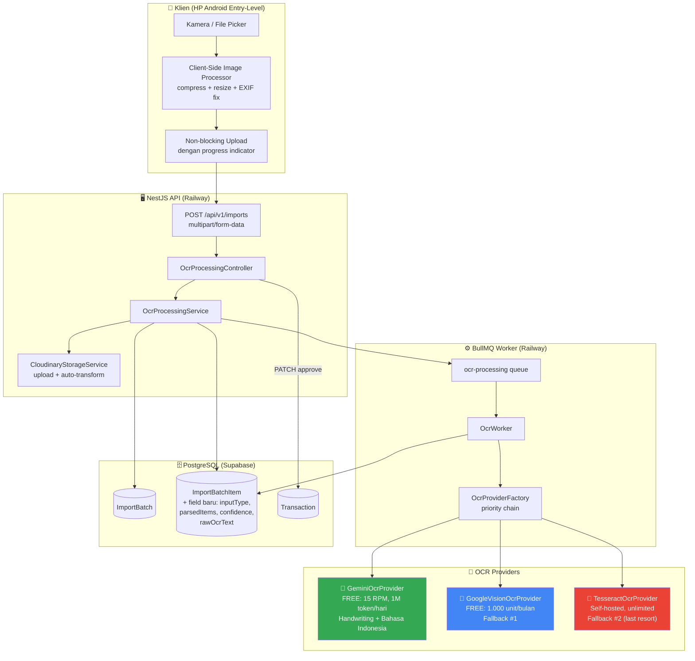
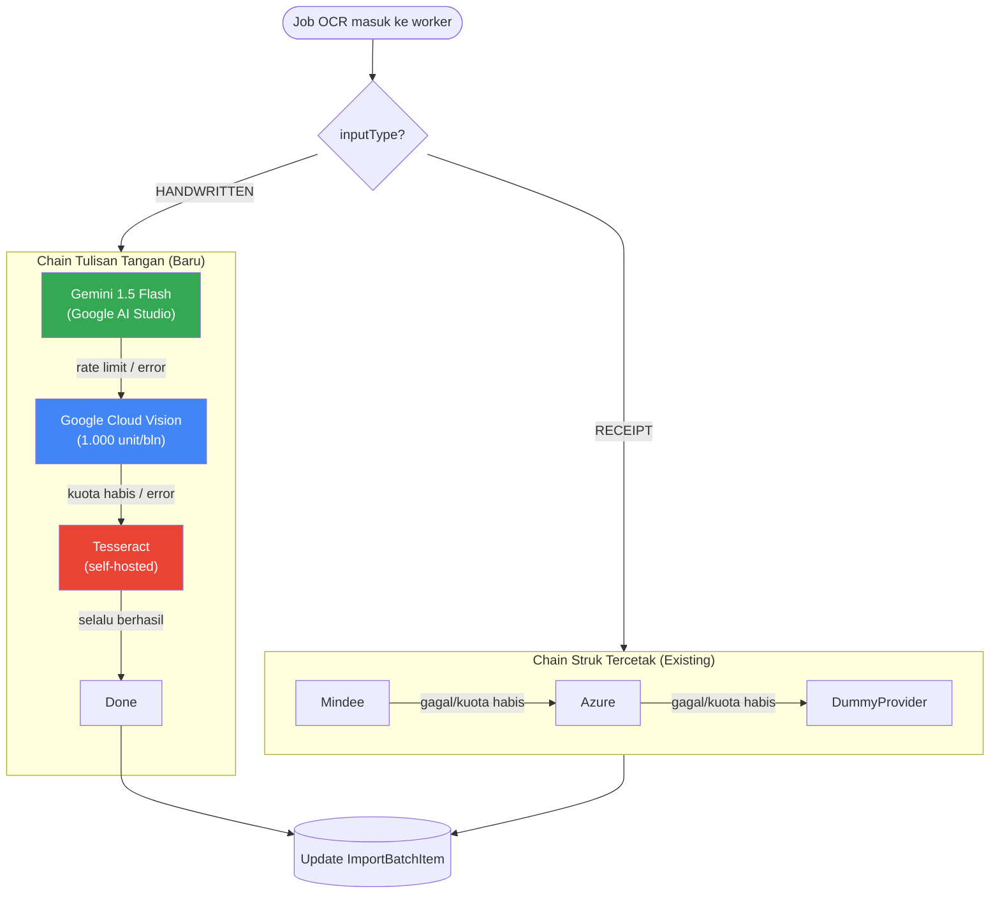
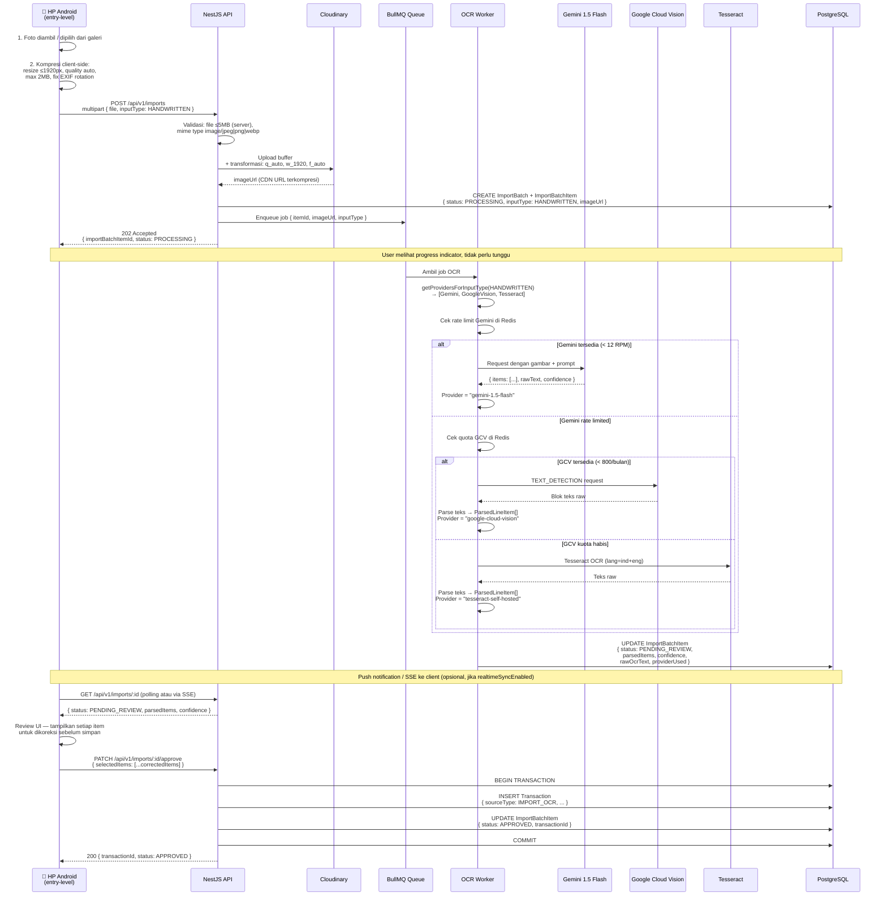
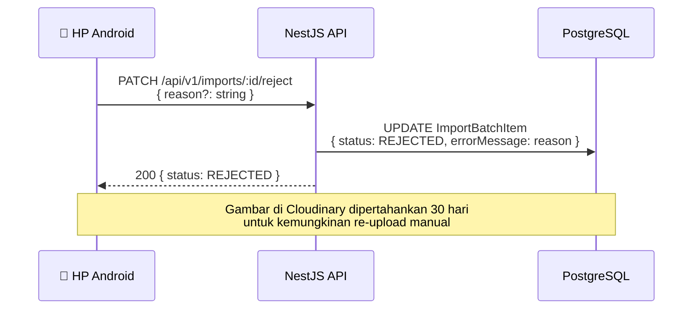
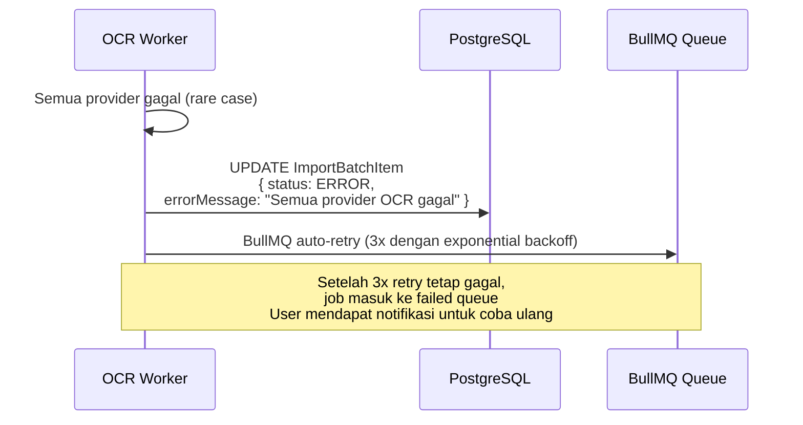
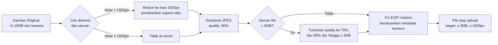

# Dokumen Desain: Handwritten Scan (Pindai Tulisan Tangan)

| | |
|---|---|
| **Jenis Dokumen** | High-Level Design |
| **Fitur** | `handwritten-scan` |
| **Versi** | 1.0 |
| **Tanggal Dibuat** | 2026 |
| **Workflow** | Design-First |
| **Status** | Draft |

---

## Daftar Isi

1. [Overview](#overview)
2. [Architecture](#architecture)
3. [Strategi Provider OCR (Free Tier Priority)](#3-strategi-provider-ocr-free-tier-priority)
4. [Ekstensi Skema Database](#4-ekstensi-skema-database)
5. [Components and Interfaces](#components-and-interfaces)
6. [Alur Data Utama](#6-alur-data-utama)
7. [Data Models](#data-models)
8. [Strategi Performa Client-Side](#8-strategi-performa-client-side)
9. [Error Handling](#error-handling)
10. [Testing Strategy](#testing-strategy)
11. [Correctness Properties](#correctness-properties)
12. [Pertimbangan Keamanan](#12-pertimbangan-keamanan)
13. [Pertimbangan Performa Backend](#13-pertimbangan-performa-backend)
14. [Dependensi](#14-dependensi)

---

## Overview

### Konteks

Mayoritas pemilik UMKM Indonesia (khususnya warung, toko kelontong, pedagang pasar) masih mencatat transaksi secara manual di buku catatan atau struk tulisan tangan. Proses digitalisasi manual ke aplikasi membutuhkan waktu dan berpotensi membuat pengguna tidak konsisten menggunakan aplikasi.

Fitur **Handwritten Scan** memungkinkan pemilik UMKM memotret halaman buku catatan atau struk tulisan tangan, lalu sistem secara otomatis mengekstrak dan memparsing transaksi menjadi data terstruktur yang siap di-review dan disetujui sebelum masuk ke database `Transaction`.

### Prinsip Desain Utama

- **Free-tier first** — Gemini 1.5 Flash sebagai provider utama (gratis 15 RPM, 1M token/hari) dengan fallback berlapis ke Google Cloud Vision → Tesseract.
- **Human-in-the-loop wajib** — tidak ada auto-commit; setiap hasil OCR masuk ke staging (`PENDING_REVIEW`) dan butuh approval eksplisit pengguna. Ini non-negosiabel sesuai project constitution.
- **Performa HP entry-level** — kompresi gambar di sisi klien sebelum upload; target maks 2MB, 1920px lebar, orientasi EXIF diperbaiki otomatis.
- **Extend, bukan replace** — memanfaatkan infrastruktur OCR yang sudah ada (`ImportBatch`, `ImportBatchItem`, `OcrProvider` interface, BullMQ worker, `OcrProviderFactory`) dengan perubahan minimal.
- **Multi-item parsing** — satu foto buku catatan bisa memuat banyak transaksi (misal: "Senin: beli bahan 50rb, jual nasi 200rb"). Field `parsedItems: Json` menampung array item hasil parsing.

### Batasan Tidak Berubah (Non-Negotiable Constraints)

- `businessId` selalu dari JWT token, tidak pernah dari request body.
- Semua uang disimpan sebagai `Decimal`, tidak pernah `Float`.
- `ImportBatchItem` yang sudah `APPROVED` menghasilkan tepat satu `Transaction` (1:1).
- Tidak ada duplikasi business logic di layer controller atau worker.
- Semua env var divalidasi Zod saat startup.

---

## Architecture

Fitur ini adalah **ekstensi dari modul `ocr-processing` yang sudah ada**. Tidak ada modul baru yang dibuat — hanya perluasan provider, skema, dan DTO yang sudah ada.



### Posisi dalam Module Boundary

Sesuai `01-architecture.md` Section 3, fitur ini sepenuhnya berada di dalam modul `import-ocr`. Tidak ada modul lain yang perlu diubah kecuali:

| Komponen | Perubahan | Alasan |
|---|---|---|
| `prisma/schema.prisma` | Tambah field ke `ImportBatchItem` | Menyimpan metadata scan tulisan tangan |
| `ocr-processing/providers/` | Tambah `GeminiOcrProvider`, `GoogleVisionOcrProvider`, `TesseractOcrProvider` | Provider baru sesuai strategi free-tier |
| `ocr-processing/providers/ocr-provider.interface.ts` | Perluas `NormalizedReceiptResult` | Multi-item parsing untuk halaman buku catatan |
| `ocr-processing/providers/ocr-provider.factory.ts` | Update priority chain | Urutan: Gemini → Google Vision → Tesseract |
| `ocr-processing/dto/` | Tambah `inputType` di upload DTO | Membedakan `RECEIPT` vs `HANDWRITTEN` |
| `ocr.worker.ts` | Simpan `rawOcrText`, `confidence`, `parsedItems` | Field baru di skema |

---

## 3. Strategi Provider OCR (Free Tier Priority)

### 3.1 Perbandingan Provider

| Provider | Free Tier | Keunggulan untuk Tulisan Tangan | Keterbatasan | Prioritas |
|---|---|---|---|---|
| **Gemini 1.5 Flash** (Google AI Studio) | 15 RPM, 1M token/hari, **tanpa kartu kredit** | ⭐⭐⭐ LLM-powered — memahami konteks, Bahasa Indonesia, tulisan tidak beraturan, multi-item per halaman | 15 RPM bisa jadi bottleneck saat ramai | #1 (Primary) |
| **Google Cloud Vision** (OCR API) | 1.000 unit/bulan | ⭐⭐ Baik untuk teks cetak, cukup untuk tulisan rapi | Kurang kuat untuk tulisan tangan tidak beraturan; kuota bulanan terbatas | #2 (Fallback 1) |
| **Tesseract** (self-hosted di Railway) | Tidak terbatas | ⭐ Teks Latin standar; mudah dikonfigurasi untuk Bahasa Indonesia (`lang=ind`) | Akurasi rendah untuk tulisan tangan; membutuhkan RAM di Railway worker | #3 (Last Resort) |

> **Catatan Arsitektur:** Provider Mindee dan Azure (yang sudah ada di kode) tetap dipertahankan untuk alur struk tercetak (printed receipt). Prioritas chain handwritten scan menggunakan chain tersendiri yang berbeda dari chain struk cetak. `inputType` pada `ImportBatchItem` menentukan chain mana yang dipakai di worker.

### 3.2 Desain Chain Provider



### 3.3 GeminiOcrProvider — Desain Prompt

Gemini 1.5 Flash dipilih karena kemampuannya memahami tulisan tangan bahasa Indonesia dan memparsing banyak item dalam satu gambar. Berikut desain prompt system-nya:

```
Kamu adalah asisten pembukuan UMKM Indonesia yang sangat teliti.
Analisis gambar ini dengan seksama. Gambar mungkin berisi:
- Halaman buku catatan dengan beberapa transaksi
- Struk tulisan tangan dari toko/warung
- Catatan pengeluaran/pemasukan harian

Tugasmu:
1. Ekstrak SEMUA transaksi yang ada di gambar
2. Untuk setiap transaksi, identifikasi: deskripsi, jumlah uang (Rupiah), 
   tanggal (jika ada), jenis (pemasukan/pengeluaran)
3. Jika jumlah tidak jelas, sertakan nilai 0 dan tandai confidence rendah
4. Kembalikan hasil dalam format JSON yang valid

Format output WAJIB:
{
  "items": [
    {
      "description": "string",
      "amount": number,
      "type": "MASUK" | "KELUAR",
      "date": "YYYY-MM-DD | null",
      "confidence": 0.0-1.0
    }
  ],
  "rawText": "teks lengkap yang berhasil dibaca",
  "overallConfidence": 0.0-1.0,
  "language": "id" | "mixed"
}
```

### 3.4 Quota Management

Mengikuti pola existing di `01-architecture.md` Section 6.3 (Centralized Quota Service):

- **Gemini**: Dilindungi rate limiter di Redis. Key: `quota:gemini:rpm:{businessId}` dengan window 60 detik. Jika > 12 RPM (buffer 80%), skip ke provider berikutnya.
- **Google Cloud Vision**: Key: `quota:gcv:monthly:{YYYY-MM}`. Counter naik setiap pemakaian. Di atas 800 unit (80% dari 1.000), skip ke Tesseract.
- **Tesseract**: Tidak ada kuota — selalu jadi fallback terakhir.

---

## 4. Ekstensi Skema Database

### 4.1 Penambahan Enum

```prisma
enum InputType {
  RECEIPT     // Struk tercetak (alur existing)
  HANDWRITTEN // Catatan tangan / buku
}
```

### 4.2 Perluasan Model `ImportBatchItem`

Field yang ditambahkan ke model yang sudah ada:

```prisma
model ImportBatchItem {
  // ... field yang sudah ada tidak berubah ...
  id             String       @id @default(cuid())
  batchId        String
  status         ImportStatus @default(PROCESSING)
  parsedData     Json?
  providerUsed   String?
  transactionId  String?      @unique
  imageUrl       String?
  errorMessage   String?
  createdAt      DateTime     @default(now())
  updatedAt      DateTime     @updatedAt

  // ─── Field baru untuk handwritten scan ──────────────
  inputType      InputType    @default(RECEIPT)
  // Array item hasil parsing (untuk multi-item per halaman buku catatan)
  // Contoh: [{ description, amount, type, date, confidence }, ...]
  parsedItems    Json?
  // Skor kepercayaan keseluruhan dari provider OCR (0.0 - 1.0)
  confidence     Float?
  // Teks mentah yang dikeluarkan provider (untuk debugging & audit)
  rawOcrText     String?

  batch       ImportBatch  @relation(fields: [batchId], references: [id])
  transaction Transaction? @relation(fields: [transactionId], references: [id])

  @@index([batchId])
  @@index([status])
  @@index([inputType])  // index baru
}
```

### 4.3 Alasan Desain

- **`parsedItems: Json?`** (bukan `parsedData`) — `parsedData` yang sudah ada menyimpan hasil OCR gaya lama (satu transaksi per gambar). `parsedItems` dirancang untuk array multi-item. Keduanya dipertahankan untuk backward compatibility.
- **`confidence: Float?`** — Float diizinkan di sini karena ini adalah skor metadata (0.0–1.0), **bukan nilai uang**. Nilai uang tetap wajib `Decimal`.
- **`rawOcrText: String?`** — Penting untuk debugging saat pengguna melaporkan hasil OCR yang salah. Juga berguna untuk fine-tuning prompt di masa depan.
- **`inputType: InputType`** — Menentukan chain provider mana yang digunakan di worker, dan memungkinkan analisis performa per tipe di masa depan.

---

## Components and Interfaces

### `OcrProvider` Interface (Diperluas)

```typescript
// src/modules/ocr-processing/providers/ocr-provider.interface.ts

export interface ParsedLineItem {
  description: string;
  amount: number;          // Nilai nominal (dikonversi ke Decimal saat simpan ke DB)
  type: 'MASUK' | 'KELUAR';
  date: string | null;     // ISO 8601 atau null jika tidak tersedia
  confidence: number;      // 0.0 - 1.0
}

export interface NormalizedReceiptResult {
  // Field existing (backward compatible)
  merchantName?: string;
  totalAmount?: number;
  date?: string;
  rawText?: string;
  confidence: number;

  // Field baru untuk handwritten scan
  items?: ParsedLineItem[];        // Array item — isi jika inputType = HANDWRITTEN
  rawOcrText?: string;             // Teks mentah dari provider
  overallConfidence?: number;      // Confidence keseluruhan halaman
}

export interface OcrProvider {
  name: string;
  // Mendukung inputType untuk routing di factory
  supportedInputTypes: InputType[];
  extractReceipt(
    fileBuffer: Buffer,
    inputType: InputType,
  ): Promise<NormalizedReceiptResult>;
}
```

### `GeminiOcrProvider`

```typescript
// src/modules/ocr-processing/providers/gemini-ocr.provider.ts

interface GeminiOcrProvider extends OcrProvider {
  name: 'gemini-1.5-flash';
  supportedInputTypes: [InputType.HANDWRITTEN, InputType.RECEIPT];
  
  // Rate limiter key: quota:gemini:rpm:{businessId}
  // Window: 60 detik, max: 12 request (80% dari 15 RPM free tier)
  isRateLimited(businessId: string): Promise<boolean>;
  
  extractReceipt(
    fileBuffer: Buffer,
    inputType: InputType,
  ): Promise<NormalizedReceiptResult>;
}
```

**Tanggung jawab:**
- Encode gambar ke base64 untuk Gemini Vision API
- Kirim prompt terstruktur (lihat Section 3.3)
- Parse response JSON dari Gemini
- Cek dan update quota rate limiter di Redis
- Graceful fallback jika response JSON Gemini tidak valid (kembalikan `confidence: 0`)

### `GoogleVisionOcrProvider`

```typescript
// src/modules/ocr-processing/providers/google-vision-ocr.provider.ts

interface GoogleVisionOcrProvider extends OcrProvider {
  name: 'google-cloud-vision';
  supportedInputTypes: [InputType.HANDWRITTEN, InputType.RECEIPT];
  
  // Quota key: quota:gcv:monthly:{YYYY-MM}
  // Max: 800 per bulan (80% dari 1.000 free tier)
  isQuotaExhausted(): Promise<boolean>;
  
  extractReceipt(
    fileBuffer: Buffer,
    inputType: InputType,
  ): Promise<NormalizedReceiptResult>;
}
```

**Tanggung jawab:**
- Gunakan `TEXT_DETECTION` feature dari Google Cloud Vision API
- Parse blok teks yang dikembalikan menjadi `ParsedLineItem[]` menggunakan heuristik (regex deteksi angka Rupiah, kata kunci pengeluaran/pemasukan)
- Update monthly quota counter di Redis

### `TesseractOcrProvider`

```typescript
// src/modules/ocr-processing/providers/tesseract-ocr.provider.ts

interface TesseractOcrProvider extends OcrProvider {
  name: 'tesseract-self-hosted';
  supportedInputTypes: [InputType.HANDWRITTEN, InputType.RECEIPT];
  
  // Tidak ada kuota — selalu tersedia
  extractReceipt(
    fileBuffer: Buffer,
    inputType: InputType,
  ): Promise<NormalizedReceiptResult>;
}
```

**Tanggung jawab:**
- Jalankan Tesseract dengan `lang=ind+eng` untuk Bahasa Indonesia + Inggris
- Pre-processing sederhana: grayscale + threshold sebelum OCR (meningkatkan akurasi tulisan tangan)
- Parse output teks dengan regex untuk mengekstrak angka Rupiah
- `confidence` selalu rendah (0.3–0.5) sebagai sinyal ke UI untuk minta review ketat

### `OcrProviderFactory` (Diperbarui)

```typescript
// src/modules/ocr-processing/providers/ocr-provider.factory.ts

interface OcrProviderFactory {
  // Kembalikan chain provider sesuai inputType
  // HANDWRITTEN: [Gemini, GoogleVision, Tesseract]
  // RECEIPT:     [Mindee, Azure, Dummy] (existing, tidak berubah)
  getProvidersForInputType(inputType: InputType): OcrProvider[];
}
```

### Upload DTO (Diperluas)

```typescript
// src/modules/ocr-processing/dto/upload-import.dto.ts

class UploadImportDto {
  // Field baru — opsional, default RECEIPT untuk backward compatibility
  @IsOptional()
  @IsEnum(InputType)
  inputType?: InputType = InputType.RECEIPT;
}
```

---

## 6. Alur Data Utama

### 6.1 Alur Upload dan Pemrosesan OCR



### 6.2 Alur Reject



### 6.3 Alur Error Worker



---

## Data Models

### `ParsedLineItem` (Type di Application Layer)

```typescript
interface ParsedLineItem {
  description: string;          // "Beli gula pasir 2kg"
  amount: number;               // 26000 (dalam Rupiah, dikonversi ke Decimal saat INSERT)
  type: 'MASUK' | 'KELUAR';    // Diinfer dari konteks atau input pengguna
  date: string | null;          // "2026-08-19" atau null
  confidence: number;           // 0.0–1.0 per item
}
```

### `parsedItems` Column (Format JSON di Database)

Kolom `parsedItems` di `ImportBatchItem` menyimpan array `ParsedLineItem`:

```json
[
  {
    "description": "Beli tepung terigu 5kg",
    "amount": 62500,
    "type": "KELUAR",
    "date": "2026-08-19",
    "confidence": 0.92
  },
  {
    "description": "Bayar listrik",
    "amount": 185000,
    "type": "KELUAR",
    "date": "2026-08-19",
    "confidence": 0.88
  },
  {
    "description": "Jualan nasi goreng",
    "amount": 450000,
    "type": "MASUK",
    "date": null,
    "confidence": 0.75
  }
]
```

### Approve Multi-Item DTO

Karena satu halaman buku bisa menghasilkan banyak `ParsedLineItem`, proses approval mengizinkan pengguna memilih item mana yang akan disimpan sebagai `Transaction`:

```typescript
// src/modules/ocr-processing/dto/approve-import.dto.ts (diperluas)

class ApproveLineItemDto {
  @IsString() @IsNotEmpty()
  description: string;

  @IsPositiveDecimal()
  amount: string;                // String Decimal, bukan number

  @IsEnum(TransactionType)
  type: TransactionType;

  @IsString() @IsISO8601()
  occurredAt: string;

  @IsString() @IsUUID()
  accountId: string;

  @IsOptional() @IsString() @IsUUID()
  categoryId?: string;
}

class ApproveImportDto {
  // Untuk HANDWRITTEN: array item yang dipilih + dikoreksi user
  @IsOptional()
  @IsArray()
  @ValidateNested({ each: true })
  @Type(() => ApproveLineItemDto)
  selectedItems?: ApproveLineItemDto[];

  // Untuk RECEIPT (backward compatible): field existing tetap ada
  @IsOptional() @IsString() @IsUUID()
  accountId?: string;

  @IsOptional() @IsEnum(TransactionType)
  type?: TransactionType;
  
  // ... field existing lainnya ...
}
```

> **Catatan Implementasi:** Saat `inputType = HANDWRITTEN` dan `selectedItems` diisi, `OcrProcessingService.approveImport()` akan memanggil `TransactionService.createTransaction()` dalam sebuah loop di dalam satu `prisma.$transaction()` untuk memastikan atomisitas — semua item berhasil atau semua rollback. Namun karena constraint `transactionId @unique` di `ImportBatchItem`, sebuah `ImportBatchItem` hanya boleh menghasilkan **satu** `Transaction`. Untuk multi-item, solusinya adalah satu `ImportBatchItem` menghasilkan tepat satu `Transaction` per item yang di-approve — lihat Section 11 Correctness Properties untuk detailnya.

---

## 8. Strategi Performa Client-Side

### 8.1 Tujuan

Pengguna target menggunakan HP Android entry-level (3–4GB RAM, koneksi 4G/3G yang tidak stabil). Upload gambar berukuran besar akan membuat pengguna frustrasi dan meninggalkan fitur.

### 8.2 Pipeline Kompresi Gambar



**Library yang direkomendasikan (frontend):**
- [`browser-image-compression`](https://www.npmjs.com/package/browser-image-compression) — zero-dependency, Web Worker support (non-blocking UI thread)
- Atau native Canvas API + `exifr` untuk EXIF metadata reading

### 8.3 Non-blocking Upload Pattern

```
1. User tap "Scan" → kamera/file picker terbuka
2. User pilih gambar → SEGERA tampilkan preview thumbnail (tidak tunggu kompresi)
3. Kompresi berjalan di background (Web Worker — tidak blokir UI)
4. Tampilkan progress bar: "Memproses gambar..." → "Mengunggah..."
5. Upload ke server dengan XMLHttpRequest (bukan fetch) untuk progress events
6. Saat upload selesai (202 diterima), tampilkan: "Gambar berhasil dikirim, sedang diproses..."
7. Polling setiap 3 detik ATAU terima SSE event saat status berubah ke PENDING_REVIEW
8. Tampilkan notifikasi: "Hasil scan siap ditinjau" → user tap → buka Review UI
```

### 8.4 Optimasi Cloudinary di Backend

Cloudinary dikonfigurasi dengan transformation otomatis saat upload:

```
/api/v1/imports → OcrProcessingService → CloudinaryStorageService
uploadFile(buffer, filename, {
  transformation: [
    { quality: 'auto:good' },    // Kompresi otomatis
    { fetch_format: 'auto' },    // Konversi ke WebP jika browser support
    { width: 1920, crop: 'limit' }, // Tidak upscale, hanya downscale jika perlu
  ]
})
```

Ini memberikan lapisan kompresi kedua di server, bahkan jika kompresi client-side tidak berjalan optimal (misal: browser lama).

---

## Error Handling

### Error Saat Upload

| Kondisi | HTTP Status | `errorCode` | Pesan (Bahasa Indonesia) |
|---|---|---|---|
| File lebih dari 5MB setelah kompresi | 400 | `FILE_TOO_LARGE` | Ukuran file terlalu besar. Coba foto dengan pencahayaan lebih baik. |
| Tipe file tidak didukung | 400 | `INVALID_FILE_TYPE` | Format file tidak didukung. Gunakan foto JPEG atau PNG. |
| Tidak ada file dikirim | 400 | `FILE_REQUIRED` | Pilih foto terlebih dahulu sebelum mengirim. |
| Upload Cloudinary gagal | 503 | `STORAGE_UNAVAILABLE` | Gagal menyimpan foto. Coba beberapa saat lagi. |

### Error Saat Pemrosesan OCR (Worker)

| Kondisi | Status `ImportBatchItem` | `errorMessage` |
|---|---|---|
| Gambar terlalu blur / gelap | `ERROR` | "Foto terlalu gelap atau buram. Coba foto ulang dengan pencahayaan lebih baik." |
| Semua provider gagal setelah retry | `ERROR` | "Sistem tidak dapat membaca foto ini. Coba masukkan transaksi secara manual." |
| Rate limit terlampaui untuk semua provider | `ERROR` | "Sistem sedang sibuk. Coba lagi dalam beberapa menit." |
| Gambar tidak mengandung teks | `PENDING_REVIEW` | - (parsedItems kosong, confidence = 0) |

### Error Saat Approve

| Kondisi | HTTP Status | `errorCode` |
|---|---|---|
| Item sudah diapprove / direjek | 400 | `IMPORT_ALREADY_PROCESSED` |
| Item masih dalam status `PROCESSING` | 400 | `IMPORT_NOT_READY` |
| `amount` tidak valid (negatif / nol) | 400 | `INVALID_AMOUNT` |
| `occurredAt` lebih dari 24 jam di masa depan | 400 | `INVALID_DATE` |
| `accountId` tidak ditemukan / bukan milik business ini | 404 | `ACCOUNT_NOT_FOUND` |

---

## Testing Strategy

### Unit Testing

**Target coverage**: Service dan Provider masing-masing minimum 80%.

```
src/modules/ocr-processing/
  ocr-processing.service.spec.ts      ← Sudah ada, diperluas
  providers/
    gemini-ocr.provider.spec.ts       ← Baru
    google-vision-ocr.provider.spec.ts ← Baru
    tesseract-ocr.provider.spec.ts    ← Baru
    ocr-provider.factory.spec.ts      ← Diperluas untuk routing berdasarkan inputType
```

**Kasus test kritis per provider:**
- Happy path: gambar valid → `NormalizedReceiptResult` valid
- Gambar kosong / corrupt → graceful error, tidak crash worker
- Response provider tidak valid (JSON malformed dari Gemini) → fallback dengan confidence 0
- Rate limit / quota terlampaui → `isRateLimited()` / `isQuotaExhausted()` return true

### Property-Based Testing Approach

**Property Test Library**: fast-check

Menggunakan library **fast-check** (konsisten dengan stack TypeScript/NestJS).

**Properti yang diuji:**

```typescript
// Property 1: Jumlah yang diparsing selalu positif
fc.assert(
  fc.property(fc.record({ amount: fc.float({ min: 0.01, max: 1_000_000 }) }), (item) => {
    return item.amount > 0;
  })
);

// Property 2: Tanggal yang diparsing tidak lebih dari 24 jam di masa depan
fc.assert(
  fc.property(fc.date({ max: new Date(Date.now() + 24 * 60 * 60 * 1000) }), (date) => {
    return date.getTime() <= Date.now() + 24 * 60 * 60 * 1000 + 1000;
  })
);

// Property 3: businessId di setiap item yang disetujui selalu dari JWT
fc.assert(
  fc.property(fc.record({ businessId: fc.uuid() }), async (payload) => {
    const result = await service.approveImport(itemId, dto, payload.businessId, userId);
    const tx = await prisma.transaction.findUnique({ where: { id: result.transactionId } });
    return tx?.businessId === payload.businessId;
  })
);
```

### Integration Testing Approach

- End-to-end upload → OCR worker → PENDING_REVIEW dengan mock `GeminiOcrProvider`
- Tenant isolation: user dari `businessId` A tidak bisa akses `ImportBatchItem` milik `businessId` B
- Approve flow: PENDING_REVIEW → APPROVED → `Transaction` dibuat dengan `sourceType: IMPORT_OCR`
- Reject flow: PENDING_REVIEW → REJECTED (tidak ada Transaction dibuat)
- Idempotency: approve yang sama dikirim dua kali → hanya satu Transaction yang dibuat

---

## Correctness Properties

Properti-properti ini merupakan invariant yang **harus selalu benar** dan menjadi basis property-based tests serta acceptance criteria fitur.

### Property 1: Setiap ImportBatchItem yang disetujui menghasilkan tepat satu Transaction

```
∀ item ∈ ImportBatchItem :
  (item.status = APPROVED) ⟹ (∃! tx ∈ Transaction : tx.id = item.transactionId)
```

Setiap `ImportBatchItem` yang disetujui menghasilkan tepat satu `Transaction`. Tidak ada `ImportBatchItem` APPROVED tanpa `Transaction`, dan tidak ada `Transaction` dengan `sourceType: IMPORT_OCR` yang tidak terhubung ke `ImportBatchItem`.

**Memvalidasi: Requirements 6.1, 6.2, 6.3**

### Property 2: Semua jumlah yang diparsing selalu positif

```
∀ item ∈ ParsedLineItem :
  item.amount > 0
```

Semua jumlah yang diparsing dari gambar (sebelum review pengguna) harus positif. Jumlah nol atau negatif dari provider OCR harus ditolak atau di-flag dengan confidence = 0.

**Memvalidasi: Requirements 9.1**

### Property 3: Tanggal yang diparsing tidak lebih dari 24 jam di masa depan

```
∀ item ∈ ParsedLineItem, item.date ≠ null :
  item.date ≤ now() + 24h
```

Tanggal yang diparsing tidak boleh lebih dari 24 jam di masa depan. Tanggal jauh di masa depan mengindikasikan kesalahan parsing dan harus ditolak dengan error `INVALID_DATE`.

**Memvalidasi: Requirements 9.2, 6.8**

### Property 4: businessId selalu berasal dari JWT token

```
∀ tx ∈ Transaction, tx.sourceType = IMPORT_OCR :
  tx.businessId = jwt.businessId
```

`businessId` pada setiap transaksi yang berasal dari OCR selalu diambil dari JWT token user yang melakukan approval — tidak pernah dari payload request body.

**Memvalidasi: Requirements 6.3, 8.1**

### Property 5: State machine ImportBatchItem bersifat unidirectional

```
∀ item ∈ ImportBatchItem :
  item.status = APPROVED ⟹ item.status ≠ REJECTED ∧ item.status ≠ PROCESSING
```

`APPROVED` dan `REJECTED` adalah terminal states — tidak bisa diubah kembali ke status sebelumnya.

**Memvalidasi: Requirements 6.5, 7.3**

### Property 6: Tenant isolation wajib ditegakkan

```
∀ request ∈ /api/v1/imports/* :
  request.user.businessId = db.ImportBatch.businessId
```

Setiap akses ke endpoint imports divalidasi bahwa `ImportBatchItem` yang diakses milik `businessId` dari JWT token. Cross-tenant access menghasilkan `403 Forbidden`.

**Memvalidasi: Requirements 8.2**

### Property 7: Provider yang rate-limited tidak boleh dipanggil

```
∀ provider ∈ OcrProviders :
  provider.isRateLimited() = true ⟹ provider ∉ currentRequestChain
```

Provider yang rate-limited atau quota-exhausted tidak boleh dipanggil dalam chain request tersebut — harus di-skip ke provider berikutnya.

**Memvalidasi: Requirements 4.1, 4.3, 4.6**

### Property 8: Kompresi client-side menghasilkan output dalam batas yang ditentukan

```
∀ image ∈ InputImages :
  compress(image).size ≤ 2MB ∧ compress(image).width ≤ 1920px
```

Pipeline kompresi client-side dengan iterasi penurunan quality (80% → 70% → 60%) memastikan output selalu berada di bawah batas ukuran dan dimensi yang ditetapkan, untuk semua gambar input apapun ukuran aslinya.

**Memvalidasi: Requirements 2.2, 2.3**

---

## 12. Pertimbangan Keamanan

### 12.1 Validasi File Upload

- **MIME type validation**: Cek `Content-Type` header DAN magic bytes file (tidak hanya ekstensi). Library: `file-type` atau validasi manual.
- **Ukuran maksimum**: 5MB di level Multer middleware (server-side, tidak bisa di-bypass walaupun client tidak kompresi).
- **Sanitasi nama file**: Cloudinary menangani ini, tapi nama file lokal harus di-sanitize sebelum dipakai di log.
- **Tidak ada eksekusi konten**: File yang diupload hanya disimpan di Cloudinary sebagai binary — tidak pernah dieksekusi atau di-render di server.

### 12.2 Proteksi API Key

- `GEMINI_API_KEY`, `GOOGLE_CLOUD_VISION_API_KEY` — disimpan sebagai environment variable Railway, tidak pernah di-log.
- Validasi Zod saat startup: aplikasi gagal start jika key tidak tersedia.
- Key tidak pernah dikirim ke client atau muncul di response API.

### 12.3 Prompt Injection Prevention

Karena gambar diproses oleh Gemini (LLM), ada risiko prompt injection via teks tersembunyi di gambar (misal teks putih di background putih). Mitigasi:

- Response Gemini selalu di-parse sebagai JSON — jika tidak valid JSON, hasilnya diabaikan dan confidence diset ke 0.
- Validasi strict pada setiap field `ParsedLineItem` sebelum disimpan ke database.
- `rawOcrText` disimpan untuk audit tapi tidak pernah dieksekusi sebagai kode.

### 12.4 Rate Limiting Endpoint

- `POST /api/v1/imports` — rate limit: 10 request/menit per `businessId`. Mencegah abuse yang menghabiskan kuota provider.
- Diimplementasi menggunakan Redis (pola yang sama dengan idempotency key di Section 4a `03-backend-guide.md`).

---

## 13. Pertimbangan Performa Backend

### 13.1 Worker Tuning

- **Concurrency BullMQ Worker**: 2–3 concurrent job untuk OCR (bukan 1, bukan terlalu banyak — Gemini free tier 15 RPM harus dibagi rata).
- **Job timeout**: 60 detik per job (Gemini biasanya < 10 detik; Tesseract bisa lebih lama untuk gambar besar).
- **Retry policy**: 3x retry dengan backoff eksponensial (1s, 5s, 25s). Setelah 3x gagal → status `ERROR`, notifikasi user.

### 13.2 Database

- Index baru `@@index([inputType])` di `ImportBatchItem` untuk query filter berdasarkan tipe input.
- Tidak ada query N+1 — `ImportBatchItem` selalu di-load dengan `include: { batch: { select: { businessId } } }` dalam satu query.
- `parsedItems` dan `rawOcrText` adalah kolom besar — jangan masukkan ke query `SELECT *` untuk list view. Gunakan `select` Prisma yang eksplisit.

### 13.3 Cloudinary Optimization

- Upload dengan transformation `q_auto:good` + `w_1920,c_limit` — gambar yang disimpan sudah optimal untuk OCR (tidak terlalu kecil, tidak terlalu besar).
- URL Cloudinary yang dikirim ke provider OCR menggunakan format terkompresi, bukan original upload.

---

## 14. Dependensi

### 14.1 Dependensi Baru (Backend)

| Package | Versi Disarankan | Penggunaan |
|---|---|---|
| `@google/generative-ai` | `^0.21.0` | Gemini 1.5 Flash SDK resmi |
| `@google-cloud/vision` | `^4.3.2` | Google Cloud Vision API client |
| `tesseract.js` | `^5.1.1` | Tesseract OCR self-hosted (Node.js) |

> **Catatan:** Semua package menggunakan pinned minor version untuk stabilitas di production Railway. Pastikan versi tersedia di npm sebelum implementasi.

### 14.2 Dependensi Baru (Frontend / Client)

| Package | Versi Disarankan | Penggunaan |
|---|---|---|
| `browser-image-compression` | `^2.0.2` | Kompresi gambar di client sebelum upload |
| `exifr` | `^7.1.3` | Membaca dan memperbaiki EXIF rotation |

### 14.3 Environment Variables Baru

```bash
# Gemini (Google AI Studio — free tier)
GEMINI_API_KEY=AIza...

# Google Cloud Vision (free tier: 1.000 unit/bulan)
GOOGLE_CLOUD_VISION_API_KEY=AIza...
# ATAU menggunakan service account JSON:
GOOGLE_APPLICATION_CREDENTIALS=/path/to/service-account.json

# Tesseract — tidak perlu key, sudah self-hosted di Railway worker
# Tesseract language data (pastikan 'ind' tersedia di Railway image)
TESSERACT_LANG=ind+eng
```

Semua env var di atas wajib ditambahkan ke `src/config/env.schema.ts` (validasi Zod).

### 14.4 Railway Worker Configuration

Tesseract.js memerlukan Tesseract engine di sistem. Di Railway:

- Gunakan Docker image yang sudah include `tesseract-ocr` dan `tesseract-ocr-ind` (bahasa Indonesia)
- Atau install via `nixpacks.toml`:
  ```toml
  [phases.setup]
  nixPkgs = ["tesseract", "tesseract-data-ind"]
  ```

---

## Appendix: Ringkasan Keputusan Desain

| Keputusan | Pilihan | Alasan |
|---|---|---|
| Provider utama | Gemini 1.5 Flash | Free tier terbaik untuk tulisan tangan + Bahasa Indonesia; LLM-powered parsing kontekstual |
| Fallback chain | Google Vision → Tesseract | Progresif dari cloud (quota-limited) ke self-hosted (unlimited) |
| Multi-item parsing | `parsedItems: Json[]` (field baru) | Satu halaman buku catatan = banyak transaksi; `parsedData` existing tetap untuk backward compat |
| Schema extension | Extend `ImportBatchItem` | Reuse infrastruktur existing, minimal migration cost |
| Client compression | Max 2MB, 1920px, EXIF fix | Target HP entry-level; balance antara kualitas OCR dan kecepatan upload 4G/3G |
| Approve flow | 1 `ImportBatchItem` : 1 `Transaction` | Menjaga invariant database; multi-item di UI = multi-approve calls |
| Tenant isolation | `businessId` dari JWT, selalu | Non-negosiabel sesuai project constitution |
| Auto-commit OCR | Tidak ada — wajib review manusia | Non-negosiabel sesuai project constitution |
