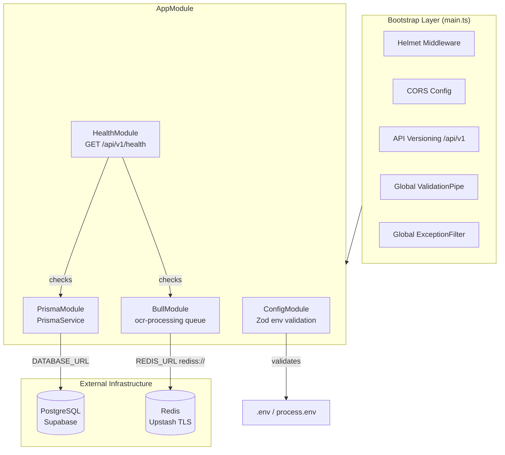
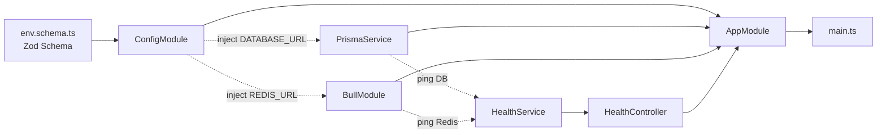

# Design Document: Phase 0 — Bootstrap Backend NestJS + Prisma

## Overview

Phase 0 adalah fondasi teknis seluruh backend UMKM Finance Tracker. Scope-nya adalah menyiapkan infrastruktur minimal yang valid sebelum ada satu pun fitur bisnis ditulis: Prisma + PostgreSQL terhubung, BullMQ + Redis siap, env divalidasi saat startup, security headers aktif, API versioning terpasang, dan health check bisa memverifikasi semua koneksi berjalan.

Semua komponen di phase ini bersifat _cross-cutting_ — digunakan oleh seluruh modul yang akan dibangun di Phase 1+. Kegagalan di phase ini (misal money stored as Float, tidak ada validasi env, tidak ada versioning) akan membebani seluruh codebase setelahnya dengan biaya refactor yang sangat mahal.

---

## High-Level Design

### Arsitektur Modul Phase 0



### Dependency Graph Antar Komponen



### Struktur Direktori Target

```
src/
  config/
    env.schema.ts           # Zod schema untuk semua env var wajib
    env.validation.ts       # fungsi validate() yang dipanggil ConfigModule
  modules/
    prisma/
      prisma.module.ts
      prisma.service.ts     # extends PrismaClient, onModuleInit/onModuleDestroy
    health/
      health.module.ts
      health.controller.ts  # GET /api/v1/health
      health.service.ts     # cek Postgres + Redis
  common/
    filters/
      global-exception.filter.ts   # format error standar
    constants/
      currency.constants.ts        # SUPPORTED_CURRENCIES whitelist
  app.module.ts
  main.ts

prisma/
  schema.prisma             # schema lengkap semua model Phase 0
  migrations/               # migration pertama (dibuat via prisma migrate dev)

.env.example                # template env var, tanpa nilai asli
README.md
```

---

## Components and Interfaces

### Component 1: ConfigModule (Env Validation)

**Purpose**: Memvalidasi semua env var wajib saat startup menggunakan Zod. Aplikasi gagal start (`process.exit(1)`) dengan pesan jelas jika ada env yang tidak terpenuhi.

**Interface**:

```typescript
// src/config/env.schema.ts
interface EnvConfig {
  DATABASE_URL: string;    // postgresql://... (Supabase pooler URL)
  REDIS_URL: string;       // rediss://... (Upstash TLS, dua-s wajib)
  JWT_ACCESS_SECRET: string;
  JWT_REFRESH_SECRET: string;
  CSRF_SECRET: string;
  NODE_ENV: 'development' | 'production' | 'test';
  PORT: number;            // default 3000 diperbolehkan
  ALLOWED_ORIGIN: string;  // misal http://localhost:3001
}
```

**Responsibilities**:
- Parse dan validasi env var dengan Zod pada saat `ConfigModule.forRoot()` dipanggil
- Fail-fast: jika ada env var wajib tidak ada atau tidak valid, lempar error dengan pesan yang menyebut nama env var yang bermasalah
- Tidak ada default value untuk secret (DATABASE_URL, JWT_*, CSRF_SECRET, REDIS_URL) — wajib eksplisit

### Component 2: PrismaModule / PrismaService

**Purpose**: Menyediakan instance `PrismaClient` yang bisa diinjeksikan ke seluruh service. Mengelola lifecycle koneksi (connect pada startup, disconnect pada shutdown).

**Interface**:

```typescript
// src/modules/prisma/prisma.service.ts
interface IPrismaService {
  onModuleInit(): Promise<void>;          // prisma.$connect()
  onModuleDestroy(): Promise<void>;       // prisma.$disconnect()
  pingDatabase(): Promise<boolean>;       // digunakan health check
}
```

**Responsibilities**:
- Export `PrismaService` dari `PrismaModule` agar bisa digunakan modul lain
- `PrismaModule` bersifat `@Global()` sehingga tidak perlu di-import ulang tiap modul
- Menyediakan method `pingDatabase()` yang menjalankan query trivial (`$queryRaw\`SELECT 1\``) untuk health check

### Component 3: BullMQ Setup

**Purpose**: Menyambungkan queue `ocr-processing` ke Upstash Redis melalui protokol `rediss://` (TLS).

**Interface**:

```typescript
// Konfigurasi queue di AppModule/dedicated module
interface BullQueueConfig {
  queueName: 'ocr-processing';
  connection: {
    url: string;  // REDIS_URL dari env (rediss://...)
    maxRetriesPerRequest: null; // wajib null untuk BullMQ
  };
}
```

**Responsibilities**:
- Mendaftarkan queue `ocr-processing` via `BullModule.registerQueue()`
- Koneksi menggunakan `REDIS_URL` dari `ConfigService` — tidak ada hardcode
- Menyediakan `QueueService` atau inject `Queue` token untuk health check (ping Redis via `queue.client.ping()`)

### Component 4: HealthModule

**Purpose**: Menyediakan endpoint `GET /api/v1/health` yang memverifikasi koneksi aktif ke Postgres dan Redis secara bersamaan.

**Interface**:

```typescript
// src/modules/health/health.service.ts
interface HealthStatus {
  status: 'ok' | 'degraded' | 'error';
  timestamp: string;       // ISO 8601
  services: {
    database: ServiceCheck;
    redis: ServiceCheck;
  };
}

interface ServiceCheck {
  status: 'ok' | 'error';
  latencyMs?: number;
  error?: string;
}
```

**Responsibilities**:
- Controller hanya memanggil `HealthService.check()` — tidak ada logic di controller
- Jika semua service OK: HTTP 200 + `{ status: 'ok', ... }`
- Jika ada service gagal: HTTP 503 + `{ status: 'error', ... }` dengan detail error per service
- Latency diukur dengan `Date.now()` diff sebelum/sesudah ping

### Component 5: GlobalExceptionFilter

**Purpose**: Menormalkan semua error response ke format standar yang konsisten di seluruh API.

**Interface**:

```typescript
// Format response error standar
interface ErrorResponse {
  statusCode: number;
  errorCode: string;        // SCREAMING_SNAKE_CASE
  message: string;          // bahasa Indonesia awam
  timestamp: string;        // ISO 8601
}
```

**Responsibilities**:
- Menangkap semua `HttpException` dan exception lain yang tidak tertangani
- Memetakan `HttpException` ke format standar
- Exception yang tidak dikenal → HTTP 500 dengan `errorCode: 'INTERNAL_SERVER_ERROR'`

---

## Data Models

### Prisma Schema — Model Lengkap

Semua kolom uang menggunakan `Decimal @db.Decimal(15, 2)` dan dipasangkan dengan kolom `currency String @db.Char(3)`.

```prisma
// prisma/schema.prisma

generator client {
  provider = "prisma-client-js"
}

datasource db {
  provider = "postgresql"
  url      = env("DATABASE_URL")
}

// ─── Enums ─────────────────────────────────────────────

enum Role {
  OWNER
  STAFF
}

enum UserStatus {
  ACTIVE
  INVITED
  DISABLED
}

enum TransactionType {
  MASUK
  KELUAR
  TRANSFER
}

enum TransactionStatus {
  CONFIRMED
  VOID
}

enum TransactionSourceType {
  MANUAL
  IMPORT_OCR
}

enum AuditAction {
  CREATE
  UPDATE
  DELETE
}

// ─── Business ──────────────────────────────────────────

model Business {
  id           String   @id @default(cuid())
  name         String
  baseCurrency String   @db.Char(3) @default("IDR")
  createdAt    DateTime @default(now())
  updatedAt    DateTime @updatedAt
  deletedAt    DateTime?

  users        User[]
  accounts     Account[]
  categories   Category[]
  transactions Transaction[]
  exchangeRates ExchangeRate[]
  auditLogs    AuditLog[]

  @@index([deletedAt])
}

// ─── User ───────────────────────────────────────────────

model User {
  id           String     @id @default(cuid())
  businessId   String
  email        String     @unique
  passwordHash String
  role         Role
  status       UserStatus @default(ACTIVE)
  createdAt    DateTime   @default(now())
  updatedAt    DateTime   @updatedAt
  deletedAt    DateTime?

  business     Business   @relation(fields: [businessId], references: [id])
  transactions Transaction[]
  auditLogs    AuditLog[]

  @@index([businessId])
  @@index([email])
  @@index([deletedAt])
}

// ─── Account ────────────────────────────────────────────

model Account {
  id         String    @id @default(cuid())
  businessId String
  name       String
  // currency ditetapkan sekali saat dibuat — TIDAK PERNAH DIUBAH setelah ada transaksi
  currency   String    @db.Char(3)
  balance    Decimal   @db.Decimal(15, 2)
  createdAt  DateTime  @default(now())
  updatedAt  DateTime  @updatedAt
  deletedAt  DateTime?

  business             Business      @relation(fields: [businessId], references: [id])
  transactions         Transaction[] @relation("AccountTransactions")
  counterTransactions  Transaction[] @relation("CounterAccountTransactions")

  @@index([businessId])
  @@index([currency])
  @@index([deletedAt])
}

// ─── Category ───────────────────────────────────────────

model Category {
  id         String    @id @default(cuid())
  businessId String
  name       String
  isDefault  Boolean   @default(false)
  createdAt  DateTime  @default(now())
  updatedAt  DateTime  @updatedAt
  deletedAt  DateTime?

  business     Business      @relation(fields: [businessId], references: [id])
  transactions Transaction[]

  @@index([businessId])
  @@index([deletedAt])
}

// ─── Transaction ────────────────────────────────────────

model Transaction {
  id               String                @id @default(cuid())
  businessId       String
  accountId        String
  categoryId       String?
  userId           String
  type             TransactionType
  amount           Decimal               @db.Decimal(15, 2)
  // currency selalu sama dengan Account.currency — didenormalisasi untuk efisiensi query
  currency         String                @db.Char(3)
  // Field berikut hanya relevan untuk type TRANSFER lintas-currency
  counterAccountId String?
  counterAmount    Decimal?              @db.Decimal(15, 2)
  // counterCurrency = currency akun tujuan (counterAccount.currency)
  counterCurrency  String?               @db.Char(3)
  // Kurs yang dipakai saat transaksi — disalin (snapshot), BUKAN referensi ke ExchangeRate
  // Supaya laporan historis tetap benar walau kurs di tabel ExchangeRate diperbarui
  exchangeRateUsed Decimal?              @db.Decimal(18, 6)
  description      String?
  occurredAt       DateTime
  sourceType       TransactionSourceType @default(MANUAL)
  status           TransactionStatus     @default(CONFIRMED)
  idempotencyKey   String?               @unique
  createdAt        DateTime              @default(now())
  updatedAt        DateTime              @updatedAt
  deletedAt        DateTime?

  business        Business  @relation(fields: [businessId], references: [id])
  account         Account   @relation("AccountTransactions", fields: [accountId], references: [id])
  counterAccount  Account?  @relation("CounterAccountTransactions", fields: [counterAccountId], references: [id])
  category        Category? @relation(fields: [categoryId], references: [id])
  user            User      @relation(fields: [userId], references: [id])

  @@index([businessId])
  @@index([accountId])
  @@index([occurredAt])
  @@index([status])
  @@index([deletedAt])
  @@index([idempotencyKey])
}

// ─── ExchangeRate ────────────────────────────────────────

model ExchangeRate {
  id           String   @id @default(cuid())
  businessId   String
  fromCurrency String   @db.Char(3)
  toCurrency   String   @db.Char(3)
  rate         Decimal  @db.Decimal(18, 6)
  effectiveDate DateTime
  createdAt    DateTime @default(now())
  updatedAt    DateTime @updatedAt

  business Business @relation(fields: [businessId], references: [id])

  @@index([businessId])
  @@index([fromCurrency, toCurrency, effectiveDate])
}

// ─── AuditLog ────────────────────────────────────────────

model AuditLog {
  id          String      @id @default(cuid())
  businessId  String
  userId      String?
  entityType  String      // "Transaction" | "Account" | "Category" | dst
  entityId    String
  action      AuditAction
  beforeState Json?
  afterState  Json?
  createdAt   DateTime    @default(now())

  business Business @relation(fields: [businessId], references: [id])
  user     User?    @relation(fields: [userId], references: [id])

  @@index([businessId])
  @@index([entityType, entityId])
  @@index([createdAt])
}
```

**Catatan penting pada skema:**
- Tidak ada `Float` atau `Int` untuk nilai moneter — semua `Decimal @db.Decimal(15, 2)`
- `exchangeRateUsed` bertipe `Decimal(18, 6)` karena kurs membutuhkan presisi lebih tinggi daripada amount
- `idempotencyKey` pada `Transaction` adalah implementasi idempotency untuk `POST /transactions`
- `AuditLog` tidak punya `updatedAt` dan tidak punya `deletedAt` — sengaja append-only

---

## Low-Level Design

### main.ts — Bootstrap Sequence

```typescript
// src/main.ts

import { NestFactory } from '@nestjs/core';
import { ValidationPipe } from '@nestjs/common';
import helmet from 'helmet';
import { AppModule } from './app.module';
import { ConfigService } from '@nestjs/config';
import { GlobalExceptionFilter } from './common/filters/global-exception.filter';

async function bootstrap(): Promise<void> {
  const app = await NestFactory.create(AppModule);

  // 1. Security headers (wajib, sesuai 03-backend-guide Section 10)
  app.use(
    helmet({
      contentSecurityPolicy: {
        directives: {
          defaultSrc: ["'self'"],
          connectSrc: ["'self'"],
          imgSrc: ["'self'", 'https://res.cloudinary.com'],
        },
      },
    }),
  );

  // 2. CORS (origin dari env, tidak pernah wildcard + credentials)
  const configService = app.get(ConfigService);
  const allowedOrigin = configService.get<string>('ALLOWED_ORIGIN');
  app.enableCors({
    origin: allowedOrigin,
    credentials: true,
  });

  // 3. API global prefix versioning
  app.setGlobalPrefix('api/v1');

  // 4. Global ValidationPipe (whitelist: true menolak field tidak terdaftar di DTO)
  app.useGlobalPipes(
    new ValidationPipe({
      whitelist: true,
      forbidNonWhitelisted: true,
      transform: true,
    }),
  );

  // 5. Global exception filter (format error standar)
  app.useGlobalFilters(new GlobalExceptionFilter());

  const port = configService.get<number>('PORT') ?? 3000;
  await app.listen(port);
  console.log(`Application running on: http://localhost:${port}/api/v1`);
}

bootstrap();
```

**Urutan bootstrap kritis:**
1. `helmet()` dipasang sebelum semua middleware lain
2. `ConfigService` sudah tersedia karena `ConfigModule` divalidasi saat `AppModule` load
3. Jika validasi Zod gagal di `AppModule`, `NestFactory.create()` akan throw — proses tidak pernah sampai `app.listen()`

### Env Validation (Zod Schema)

```typescript
// src/config/env.schema.ts
import { z } from 'zod';

export const envSchema = z.object({
  DATABASE_URL: z
    .string()
    .url()
    .startsWith('postgresql://', { message: 'DATABASE_URL must be a PostgreSQL connection string' }),

  REDIS_URL: z
    .string()
    .url()
    .startsWith('rediss://', { message: 'REDIS_URL must use rediss:// protocol (TLS required for Upstash)' }),

  JWT_ACCESS_SECRET: z
    .string()
    .min(32, { message: 'JWT_ACCESS_SECRET must be at least 32 characters' }),

  JWT_REFRESH_SECRET: z
    .string()
    .min(32, { message: 'JWT_REFRESH_SECRET must be at least 32 characters' }),

  CSRF_SECRET: z
    .string()
    .min(32, { message: 'CSRF_SECRET must be at least 32 characters' }),

  NODE_ENV: z.enum(['development', 'production', 'test']).default('development'),

  PORT: z
    .string()
    .transform((val) => parseInt(val, 10))
    .pipe(z.number().int().min(1).max(65535))
    .default('3000'),

  ALLOWED_ORIGIN: z
    .string()
    .url({ message: 'ALLOWED_ORIGIN must be a valid URL (e.g., http://localhost:3001)' }),
});

export type EnvConfig = z.infer<typeof envSchema>;
```

```typescript
// src/config/env.validation.ts
import { envSchema } from './env.schema';

export function validate(config: Record<string, unknown>): Record<string, unknown> {
  const result = envSchema.safeParse(config);

  if (!result.success) {
    const formatted = result.error.issues
      .map((issue) => `  - ${issue.path.join('.')}: ${issue.message}`)
      .join('\n');
    throw new Error(
      `\n\n❌ Environment validation failed:\n${formatted}\n\nCheck your .env file.\n`,
    );
  }

  return result.data as Record<string, unknown>;
}
```

### PrismaService

```typescript
// src/modules/prisma/prisma.service.ts
import { Injectable, OnModuleInit, OnModuleDestroy, Logger } from '@nestjs/common';
import { PrismaClient } from '@prisma/client';

@Injectable()
export class PrismaService extends PrismaClient implements OnModuleInit, OnModuleDestroy {
  private readonly logger = new Logger(PrismaService.name);

  async onModuleInit(): Promise<void> {
    await this.$connect();
    this.logger.log('Database connection established');
  }

  async onModuleDestroy(): Promise<void> {
    await this.$disconnect();
    this.logger.log('Database connection closed');
  }

  /**
   * Ping the database with a trivial query.
   * Digunakan oleh HealthService — tidak untuk query data bisnis.
   */
  async pingDatabase(): Promise<boolean> {
    await this.$queryRaw`SELECT 1`;
    return true;
  }
}
```

### AppModule

```typescript
// src/app.module.ts
import { Module } from '@nestjs/common';
import { ConfigModule } from '@nestjs/config';
import { BullModule } from '@nestjs/bullmq';
import { validate } from './config/env.validation';
import { PrismaModule } from './modules/prisma/prisma.module';
import { HealthModule } from './modules/health/health.module';

@Module({
  imports: [
    // 1. Config + Zod validation — HARUS PERTAMA, modul lain bergantung padanya
    ConfigModule.forRoot({
      isGlobal: true,
      validate,
    }),

    // 2. Prisma (global, supaya tidak perlu di-import ulang tiap modul)
    PrismaModule,

    // 3. BullMQ — koneksi ke Upstash Redis
    BullModule.forRootAsync({
      useFactory: () => ({
        connection: {
          url: process.env['REDIS_URL'],
          // maxRetriesPerRequest: null wajib untuk BullMQ dengan ioredis
          maxRetriesPerRequest: null,
          enableReadyCheck: false,
        },
      }),
    }),
    BullModule.registerQueue({
      name: 'ocr-processing',
    }),

    // 4. Health check module
    HealthModule,
  ],
})
export class AppModule {}
```

**Catatan**: `BullModule.forRootAsync` menggunakan `process.env['REDIS_URL']` langsung karena pada titik ini `ConfigService` NestJS belum bisa diinjeksikan ke dalam `useFactory` tanpa menambahkan `imports: [ConfigModule]` secara eksplisit di `forRootAsync`. Alternatif yang lebih bersih adalah menggunakan `inject: [ConfigService]` di dalam `forRootAsync`.

### HealthService & HealthController

```typescript
// src/modules/health/health.service.ts
import { Injectable, Logger } from '@nestjs/common';
import { InjectQueue } from '@nestjs/bullmq';
import { Queue } from 'bullmq';
import { PrismaService } from '../prisma/prisma.service';

export interface ServiceCheck {
  status: 'ok' | 'error';
  latencyMs?: number;
  error?: string;
}

export interface HealthStatus {
  status: 'ok' | 'degraded' | 'error';
  timestamp: string;
  services: {
    database: ServiceCheck;
    redis: ServiceCheck;
  };
}

@Injectable()
export class HealthService {
  private readonly logger = new Logger(HealthService.name);

  constructor(
    private readonly prisma: PrismaService,
    @InjectQueue('ocr-processing') private readonly ocrQueue: Queue,
  ) {}

  async check(): Promise<HealthStatus> {
    const [database, redis] = await Promise.all([
      this.checkDatabase(),
      this.checkRedis(),
    ]);

    const allOk = database.status === 'ok' && redis.status === 'ok';
    const anyOk = database.status === 'ok' || redis.status === 'ok';

    return {
      status: allOk ? 'ok' : anyOk ? 'degraded' : 'error',
      timestamp: new Date().toISOString(),
      services: { database, redis },
    };
  }

  private async checkDatabase(): Promise<ServiceCheck> {
    const start = Date.now();
    try {
      await this.prisma.pingDatabase();
      return { status: 'ok', latencyMs: Date.now() - start };
    } catch (err: unknown) {
      const message = err instanceof Error ? err.message : 'Unknown error';
      this.logger.error(`Database health check failed: ${message}`);
      return { status: 'error', error: message };
    }
  }

  private async checkRedis(): Promise<ServiceCheck> {
    const start = Date.now();
    try {
      const client = await this.ocrQueue.client;
      await client.ping();
      return { status: 'ok', latencyMs: Date.now() - start };
    } catch (err: unknown) {
      const message = err instanceof Error ? err.message : 'Unknown error';
      this.logger.error(`Redis health check failed: ${message}`);
      return { status: 'error', error: message };
    }
  }
}
```

```typescript
// src/modules/health/health.controller.ts
import { Controller, Get, HttpCode, HttpStatus } from '@nestjs/common';
import { HealthService, HealthStatus } from './health.service';

@Controller('health')
export class HealthController {
  constructor(private readonly healthService: HealthService) {}

  // GET /api/v1/health
  @Get()
  @HttpCode(HttpStatus.OK)
  async check(): Promise<HealthStatus> {
    const result = await this.healthService.check();

    // Kembalikan 503 kalau ada service yang tidak ok
    if (result.status === 'error') {
      // Controller tetap hanya memanggil service — exception di-throw supaya
      // GlobalExceptionFilter yang menangani HTTP 503, bukan logika di controller
      throw Object.assign(new Error('Service unavailable'), {
        status: HttpStatus.SERVICE_UNAVAILABLE,
        response: result,
      });
    }

    return result;
  }
}
```

### Currency Constants

```typescript
// src/common/constants/currency.constants.ts

/**
 * Whitelist mata uang yang didukung (sesuai 01-architecture.md §4.6).
 * Bukan full ISO 4217 — hanya 7 currency relevan untuk UMKM Indonesia.
 */
export const SUPPORTED_CURRENCIES = ['IDR', 'USD', 'SGD', 'MYR', 'EUR', 'CNY', 'AUD'] as const;

export type SupportedCurrency = (typeof SUPPORTED_CURRENCIES)[number];
```

### GlobalExceptionFilter

```typescript
// src/common/filters/global-exception.filter.ts
import {
  ExceptionFilter,
  Catch,
  ArgumentsHost,
  HttpException,
  HttpStatus,
  Logger,
} from '@nestjs/common';
import { Response } from 'express';

@Catch()
export class GlobalExceptionFilter implements ExceptionFilter {
  private readonly logger = new Logger(GlobalExceptionFilter.name);

  catch(exception: unknown, host: ArgumentsHost): void {
    const ctx = host.switchToHttp();
    const response = ctx.getResponse<Response>();

    let statusCode = HttpStatus.INTERNAL_SERVER_ERROR;
    let errorCode = 'INTERNAL_SERVER_ERROR';
    let message = 'Terjadi kesalahan pada server. Coba lagi dalam beberapa saat.';

    if (exception instanceof HttpException) {
      statusCode = exception.getStatus();
      const exceptionResponse = exception.getResponse();

      if (typeof exceptionResponse === 'object' && exceptionResponse !== null) {
        const resp = exceptionResponse as Record<string, unknown>;
        errorCode = typeof resp['errorCode'] === 'string'
          ? resp['errorCode']
          : this.statusToErrorCode(statusCode);
        message = typeof resp['message'] === 'string'
          ? resp['message']
          : 'Permintaan tidak dapat diproses.';
      }
    } else {
      this.logger.error('Unhandled exception', exception instanceof Error ? exception.stack : String(exception));
    }

    response.status(statusCode).json({
      statusCode,
      errorCode,
      message,
      timestamp: new Date().toISOString(),
    });
  }

  private statusToErrorCode(status: number): string {
    const map: Record<number, string> = {
      400: 'BAD_REQUEST',
      401: 'UNAUTHORIZED',
      403: 'FORBIDDEN',
      404: 'NOT_FOUND',
      409: 'CONFLICT',
      422: 'UNPROCESSABLE_ENTITY',
      429: 'TOO_MANY_REQUESTS',
      503: 'SERVICE_UNAVAILABLE',
    };
    return map[status] ?? 'INTERNAL_SERVER_ERROR';
  }
}
```

---

## Error Handling

### Skenario: Env Var Tidak Lengkap

**Kondisi**: Satu atau lebih env var wajib tidak ada saat startup  
**Response**: Proses gagal dengan pesan eksplisit sebelum server menerima koneksi apapun  
**Recovery**: Developer melengkapi `.env` dan restart

```
❌ Environment validation failed:
  - DATABASE_URL: Required
  - REDIS_URL: REDIS_URL must use rediss:// protocol (TLS required for Upstash)

Check your .env file.
```

### Skenario: Database Tidak Dapat Dijangkau

**Kondisi**: `GET /api/v1/health` dipanggil saat Supabase project sedang paused (auto-pause setelah 7 hari inaktif)  
**Response**: HTTP 503 dengan detail error di body  
**Recovery**: Resume project di dashboard Supabase, retry health check

### Skenario: Redis Tidak Dapat Dijangkau

**Kondisi**: `REDIS_URL` menggunakan `redis://` bukan `rediss://`  
**Response**: Validasi Zod di startup menolak dengan pesan `must use rediss://`  
**Recovery**: Perbaiki `REDIS_URL` di `.env`

---

## Correctness Properties

*A property is a characteristic or behavior that should hold true across all valid executions of a system — essentially, a formal statement about what the system should do. Properties serve as the bridge between human-readable specifications and machine-verifiable correctness guarantees.*

### Property 1: Env Validation Rejects Invalid Configurations

*For any* environment configuration object where one or more required secret variables (`DATABASE_URL`, `REDIS_URL`, `JWT_ACCESS_SECRET`, `JWT_REFRESH_SECRET`, `CSRF_SECRET`) are missing, incorrectly formatted, or too short, the `validate()` function SHALL throw an error whose message explicitly names each failing variable.

**Validates: Requirements 1.1, 1.2, 1.11**

---

### Property 2: Env Validation Accepts Only Valid Configurations

*For any* environment configuration object that satisfies all constraints (valid URLs with correct protocols, secrets ≥ 32 chars, NODE_ENV in allowed enum, PORT in 1–65535), the `validate()` function SHALL return a parsed config object without throwing.

**Validates: Requirements 1.1, 1.3, 1.4, 1.5, 1.6, 1.7, 1.8, 1.9, 1.10**

---

### Property 3: Prisma Schema Has No Monetary Float/Int Columns

*For all* fields in the Prisma schema that represent monetary values (`balance`, `amount`, `counterAmount`, `rate`, `exchangeRateUsed`), the Prisma field type SHALL be `Decimal` — never `Float`, `Int`, or any non-Decimal numeric type.

**Validates: Requirements 2.10**

---

### Property 4: Security Headers Present on All Responses

*For any* HTTP request to any endpoint registered in the Application, the response SHALL include the security headers set by Helmet: `X-Content-Type-Options: nosniff`, `X-Frame-Options: DENY`, and a non-empty `Content-Security-Policy` header.

**Validates: Requirements 4.1, 4.5**

---

### Property 5: API Versioning Prefix Enforced on All Routes

*For any* route handler registered in the Application, the route SHALL only be accessible via its `/api/v1/<path>` form. A request to the same path without the `/api/v1` prefix SHALL return HTTP 404.

**Validates: Requirements 5.1, 5.2**

---

### Property 6: Health Check Returns Consistent Status Mapping

*For any* combination of database and Redis connectivity states (both ok, one failing, both failing), the `HealthService.check()` SHALL return a `status` field that accurately reflects the aggregate state: `ok` only when both services are healthy, `degraded` when exactly one service fails, and `error` when both fail.

**Validates: Requirements 6.4, 6.5, 6.6**

---

### Property 7: Health Check Latency Is Always a Non-Negative Number

*For any* successful service ping (database or Redis), the corresponding `latencyMs` field in the `HealthStatus` response SHALL be a non-negative integer representing the measured round-trip time in milliseconds.

**Validates: Requirements 6.7**

---

### Property 8: Health Check Error Messages Contain No Stack Traces

*For any* `Error` thrown during a database or Redis ping, the `error` field in the corresponding `ServiceCheck` SHALL contain only the error's `message` string — never the full stack trace, internal class names, or memory addresses.

**Validates: Requirements 6.8, 6.9**

---

### Property 9: GlobalExceptionFilter Always Returns Standard Error Format

*For any* `HttpException` thrown anywhere in the Application with any status code and any message, the `GlobalExceptionFilter` SHALL produce a JSON response that contains exactly the fields `statusCode` (matching the exception status), `errorCode` (SCREAMING_SNAKE_CASE), `message` (string), and `timestamp` (ISO 8601 string) — no additional fields, no missing fields.

**Validates: Requirements 7.2**

---

### Property 10: GlobalExceptionFilter Status-to-ErrorCode Mapping Is Injective

*For any* `HttpException` whose HTTP status code exists in the mapping table (400, 401, 403, 404, 409, 422, 429, 503), the `errorCode` in the response SHALL be the mapped value defined in the design. A custom `errorCode` provided in the exception's response body SHALL be preserved as-is, overriding the default mapping.

**Validates: Requirements 7.4, 7.5**

---

### Property 11: GlobalExceptionFilter Never Exposes Stack Traces to Clients

*For any* exception (whether `HttpException` or an unknown error), the response body returned to the HTTP client SHALL not contain the stack trace string, internal file paths, line numbers, or any other debugging detail from the exception's `.stack` property.

**Validates: Requirements 7.3, 7.6**

---

### Property 12: ValidationPipe Enforces DTO Contract

*For any* endpoint request body that contains one or more properties not declared in the corresponding DTO class, the `GlobalValidationPipe` SHALL reject the request with HTTP 400. Conversely, *for any* request body that conforms exactly to the DTO, the pipe SHALL accept it and transform the plain object into the DTO class instance.

**Validates: Requirements 8.2, 8.3, 8.4, 8.5**

---

### Property 13: SUPPORTED_CURRENCIES Whitelist Is Exclusive

*For any* string value not contained in the `SUPPORTED_CURRENCIES` array (`['IDR', 'USD', 'SGD', 'MYR', 'EUR', 'CNY', 'AUD']`), any currency validation check against this constant SHALL return `false` or produce a validation error — ensuring that valid ISO 4217 codes outside the whitelist (e.g., `GBP`, `JPY`, `CHF`) are also rejected.

**Validates: Requirements 9.1, 9.5**

---

## Testing Strategy

### Unit Testing Approach

Setiap service memiliki unit test wajib. Untuk Phase 0, test difokuskan pada:
- `HealthService`: mock `PrismaService.pingDatabase()` dan `Queue.client.ping()` — verifikasi status mapping (ok/degraded/error)
- `GlobalExceptionFilter`: verifikasi format response untuk HttpException berbagai status code
- `validate()` (env validation): test berbagai kombinasi env yang valid dan tidak valid

### Property-Based Testing Approach

**Property Test Library**: Jest (via `fast-check`) — belum menjadi kebutuhan utama di Phase 0, tetapi dipersiapkan untuk Phase 1 (Transaction module).

### Integration Testing Approach

- `GET /api/v1/health` di-test dengan database/Redis tersedia (e2e test dengan supertest)
- Verifikasi `app.setGlobalPrefix('api/v1')` aktif — request ke `/health` tanpa prefix harus 404

---

## Dependencies yang Diperlukan

Berikut dependency baru yang perlu ditambahkan ke `package.json` (semua dengan justifikasi eksplisit sesuai `04-coding-standards.md §6`):

| Package | Tipe | Versi | Alasan |
|---|---|---|---|
| `@prisma/client` | prod | `^6.x` | ORM client — wajib sesuai stack |
| `prisma` | dev | `^6.x` | CLI untuk migration & generate |
| `@nestjs/bullmq` | prod | `^11.x` | NestJS wrapper untuk BullMQ |
| `bullmq` | prod | `^5.x` | Queue engine BullMQ |
| `ioredis` | prod | `^5.x` | Redis client yang digunakan BullMQ (peer dependency) |
| `helmet` | prod | `^8.x` | Security headers (wajib sesuai 03-backend-guide §10) |
| `zod` | prod | `^3.x` | Env validation (wajib sesuai constitution §4) |
| `@nestjs/config` | prod | `^4.x` | ConfigModule NestJS (integrasi dengan Zod validate) |
| `decimal.js` | prod | `^10.x` | Digunakan Prisma untuk field Decimal — peer dependency |

Dependency yang **sudah ada** dan tetap digunakan: `@nestjs/common`, `@nestjs/core`, `@nestjs/platform-express`, `reflect-metadata`, `rxjs`.

---

## Security Considerations

- Helmet dengan CSP eksplisit — bukan default mentah yang terlalu longgar
- CORS hanya mengizinkan origin dari `ALLOWED_ORIGIN` env var — tidak ada wildcard
- Tidak ada secret dengan nilai default — semua wajib di-set eksplisit atau aplikasi tidak mau start
- `rediss://` (TLS) wajib untuk koneksi Redis — divalidasi di level Zod, bukan hanya dokumentasi
- `DatabaseURL` dari Supabase menggunakan pooler connection (PgBouncer) — lebih aman untuk serverless/koneksi banyak

---

## Performance Considerations

- `PrismaService.$connect()` dilakukan satu kali saat modul init — koneksi digunakan ulang, bukan dibuat per request
- Health check menggunakan `Promise.all()` untuk cek Postgres dan Redis secara paralel — tidak serial
- `BullMQ` dengan `enableReadyCheck: false` untuk mencegah timeout saat koneksi Upstash pertama kali (koneksi cold start bisa lambat)
