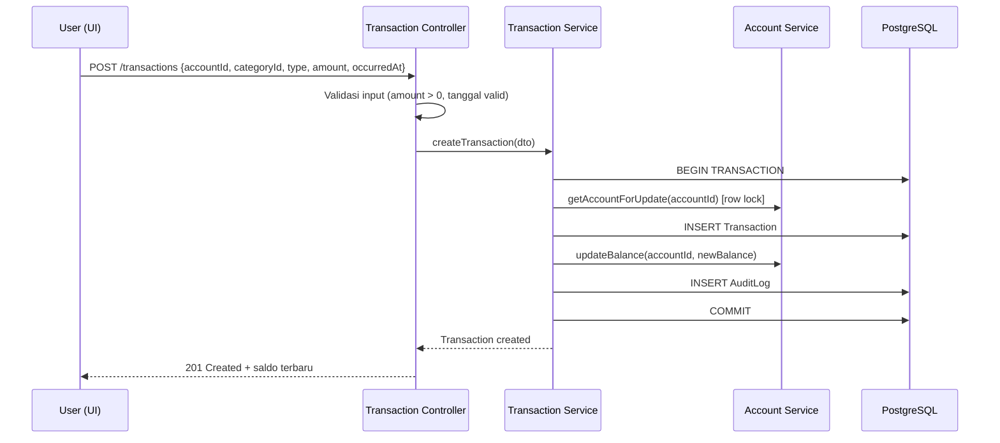
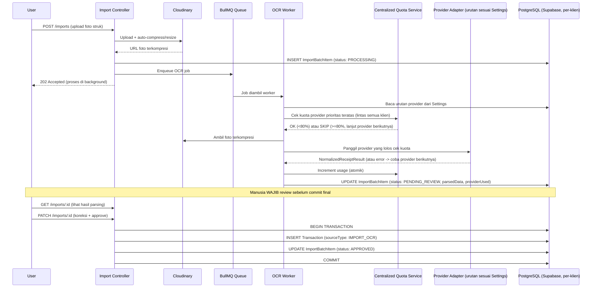
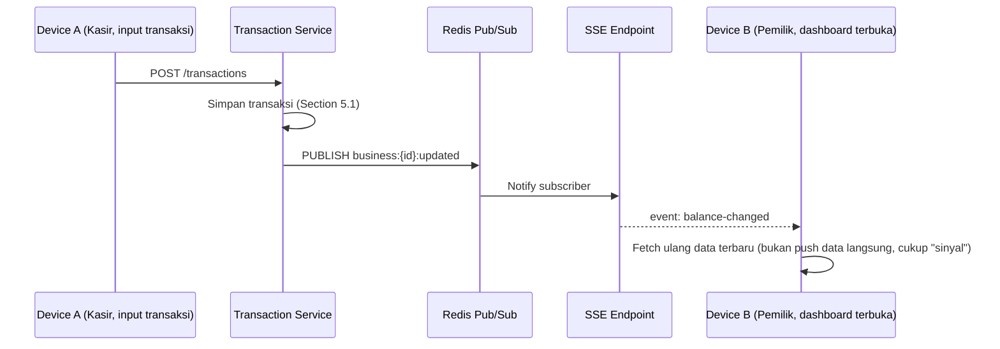
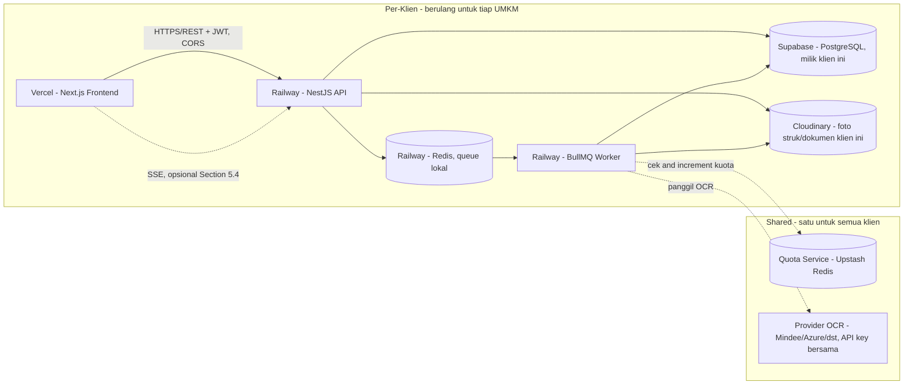
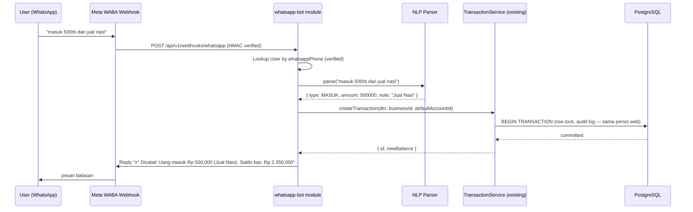

# High-Level Architecture Design
## UMKM Finance Tracker — Modular Monolith, Multi-Tenant SaaS
 
| | |
|---|---|
| **Jenis Dokumen** | System Architecture Design (High-Level) |
| **Versi** | 1.4 |
| **Tanggal Dibuat** | 10 Agustus 2026 |
| **Terakhir Diupdate** | 19 Agustus 2026 |
| **Target Skala** | Multi-tenant SaaS (default), single-tenant dedicated (premium tier) |
| **Model Bisnis** | SaaS gratis untuk UMKM mikro & kecil, premium untuk menengah, future revenue dari bank/fintech |
| **Status** | Living document — direvisi tiap ada keputusan arsitektur baru, lihat Riwayat Revisi |
 
> **Catatan penting:** Dokumen ini **tidak** mengubah keputusan non-negosiabel yang sudah ditetapkan (monolith modular, no microservices, NestJS+Prisma+PostgreSQL). Tujuannya memperdalam bagian yang biasanya hilang di brief-level: skema data, alur kritis, keamanan, dan rencana evolusi yang terkendali — bukan menambah kompleksitas infrastruktur tanpa alasan.
 
**Riwayat Revisi Utama:**
 
| Versi | Perubahan |
|---|---|
| 1.0 | Draft awal: module boundary, skema data, alur kritis, hosting dasar |
| 1.1 | Keputusan multi-user (role), sync SSE, OCR multi-provider, hosting Vercel+Railway |
| 1.2 | Stack final Vercel+Railway+Supabase+Cloudinary, Quota Service terpusat, multi-currency native |
| 1.3 | Hardening keamanan: CSRF/hybrid token (§8.5), security headers (§8.6), environment strategy (§6.4) |
| **1.4** | **Tiga perubahan strategis: (1) hosting berubah ke multi-tenant SaaS sebagai default, (2) multi-currency jadi fitur opsional bukan core UI, (3) modul WhatsApp Bot ditambahkan sebagai channel input resmi — lihat §3, §4.6, §6.1, §12** |
 
---
 
## Daftar Isi
 
1. [Executive Summary](#1-executive-summary)
2. [Apa yang "Naik Level" dari Brief Awal](#2-apa-yang-naik-level-dari-brief-awal)
3. [Module Boundary (Modular Monolith)](#3-module-boundary-modular-monolith)
4. [Data Model & Skema Inti](#4-data-model--skema-inti)
5. [Alur Kritis](#5-alur-kritis)
6. [Overall System Architecture](#6-overall-system-architecture) (termasuk §6.1 Multi-Tenant, §6.4 Environment Strategy)
7. [Non-Functional Aspects](#7-non-functional-aspects)
8. [Keamanan Data Finansial & Privasi](#8-keamanan-data-finansial--privasi) (termasuk §8.5 CSRF, §8.6 Security Headers)
9. [Risiko & Mitigasi](#9-risiko--mitigasi)
10. [Roadmap Implementasi](#10-roadmap-implementasi)
11. [Keputusan Final](#11-keputusan-final)
12. [WhatsApp Bot Architecture](#12-whatsapp-bot-architecture) *(baru v1.4)*
> Lihat juga `08-threat-model.md` untuk analisis STRIDE per komponen — dokumen terpisah supaya arsitektur (apa yang dibangun) tidak bercampur dengan analisis ancaman (kenapa dibangun begitu).
 
---
 
 
## 1. Executive Summary
 
UMKM Finance Tracker dibangun sebagai **modular monolith** dengan boundary domain yang jelas secara *kode*, bukan secara *deployment*. Filosofi ini sengaja berbeda dari platform e-commerce skala besar — kompleksitas operasional (banyak service, event bus, orkestrasi) adalah **biaya**, bukan fitur, untuk aplikasi yang dipakai satu pemilik usaha kecil.
 
**Perubahan signifikan di v1.4:** Model hosting berubah dari single-tenant per deployment
menjadi **multi-tenant SaaS sebagai default**. Platform ini sekarang dirancang untuk melayani
ratusan ribu UMKM dari satu instance, bukan satu deployment per klien. Lihat Section 6.1.
 
Lima prinsip yang menuntun dokumen ini:
 
- **Correctness over scale** — untuk aplikasi finansial, akurasi angka dan konsistensi data jauh lebih penting daripada throughput. Prioritas #1 adalah tidak pernah ada saldo yang salah, bukan latency serendah mungkin.
- **Boundary jelas walau satu deployment** — modular monolith tetap butuh disiplin: tiap modul punya tanggung jawab jelas, komunikasi antar-modul lewat service layer, supaya suatu saat *bisa* dipecah kalau memang perlu.
- **Human-in-the-loop untuk data tidak pasti** — apa pun yang berasal dari OCR/import otomatis dianggap "draft" sampai direview manusia.
- **Evolvability tanpa over-engineering** — `businessId` disimpan di skema sejak awal, multi-currency ada di database tapi disembunyikan dari UI untuk 95,9% user yang tidak butuh.
- **Meet users where they are** — web app untuk dashboard, WhatsApp Bot untuk input harian. Dua channel, satu database, satu set business logic.
### 1.2 Mind Map (Module View, bukan Service View)

```mermaid
graph TD
    Root[UMKM Finance Tracker - Monolith]
 
    Root --> API[API Layer - NestJS Controllers]
    API --> API1[REST endpoints per module]
    API --> API2[Auth Guard - JWT]
    API --> API3[Validation Pipe - class-validator]
    API --> API4[Webhook - WhatsApp Bot]
 
    Root --> MOD[Module Layer - Service/Business Logic]
    MOD --> M1[Auth and User Module - role Owner/Staff]
    MOD --> M2[Account Module - kas, bank, dompet digital]
    MOD --> M3[Transaction Module - uang masuk/keluar]
    MOD --> M4[Category Module]
    MOD --> M5[Asset and Liability Module]
    MOD --> M6[Report Module - Untung Rugi, Posisi Aset]
    MOD --> M7[Import and OCR Module - multi provider, opsional]
    MOD --> M8[Notification Module]
    MOD --> M9[Audit Log Module]
    MOD --> M11[Settings Module - termasuk enableMultiCurrency dan WA linking]
    MOD --> M12[WhatsApp Bot Module - parse NL input, panggil TransactionService]
 
    Root --> DATA[Data Layer]
    DATA --> D1[(PostgreSQL - Supabase managed, multi-tenant via RLS)]
    DATA --> D2[(Redis - Railway - queue and cache)]
    DATA --> D3[(Cloudinary - foto struk/dokumen)]
 
    MOD --> M10[Export Module - PDF, CSV, XLSX, JSON/XML bertahap]
 
    Root --> WORKER[Background Worker - BullMQ]
    WORKER --> W1[OCR processing job - multi-provider fallback]
    WORKER --> W2[Report and export generation job]
    WORKER --> W3[Notification dispatch job]
 
    Root --> INFRA[Infrastructure - Vercel + Railway + Supabase + Cloudinary]
    INFRA --> IN1[Vercel - Next.js frontend]
    INFRA --> IN2[Railway - NestJS API + Worker + Redis]
    INFRA --> IN3[Supabase - PostgreSQL + PITR backup + RLS multi-tenant]
    INFRA --> IN4[Cloudinary - foto/dokumen + auto-compress]
    INFRA --> IN5[Meta WABA - WhatsApp Business API webhook]
 
    Root --> CHANNEL[Input Channels]
    CHANNEL --> CH1[Web App - dashboard, laporan, settings, input lengkap]
    CHANNEL --> CH2[WhatsApp Bot - input cepat harian, saldo, laporan ringkas]
```
 

 
**Perbedaan kunci dari arsitektur e-commerce besar:** tidak ada API Gateway terpisah, tidak ada service mesh, tidak ada Kafka. Komunikasi antar modul terjadi lewat **pemanggilan service langsung dalam satu proses** (in-process function call), bukan lewat network call atau message broker. Ini jauh lebih sederhana untuk debug, deploy, dan dipahami satu-dua orang developer.
 
---
 
## 2. Apa yang "Naik Level" dari Brief Awal
 
Brief Anda sudah kuat di prinsip non-negosiabel dan tech stack, tapi belum menjawab beberapa hal yang biasanya jadi sumber bug/kesalahan di aplikasi finansial. Berikut yang saya tambahkan di dokumen ini:
 
| Area | Sudah ada di brief? | Ditambahkan di sini |
|---|---|---|
| Prinsip desain & non-goals | ✅ Kuat | — |
| Tech stack | ✅ Jelas | — |
| **Skema data konkret** | ❌ Belum | Section 4 — model Account, Transaction, ledger-lite |
| **Alur transaksi step-by-step** | ❌ Belum | Section 5 — termasuk race condition handling |
| **Model konsistensi saldo** | ⚠️ Disebut "harus atomik" tapi belum ada pola konkret | Section 5.1 — double-entry-lite vs running balance |
| **Strategi backup & disaster recovery** | ❌ Belum | Section 7.2 — krusial karena ini data finansial usaha orang |
| **Audit trail** | ⚠️ Tersirat dari "atomik" tapi tidak eksplisit | Section 4.4 & 8.3 |
| **Multi-device/multi-user per UMKM** | ❌ Belum dibahas | Section 11 — pertanyaan terbuka untuk Anda |
| **Retensi data & hak pengguna hapus data** | ❌ Belum | Section 8.4 |
| **Observability minimal (bukan full APM)** | ❌ Belum | Section 7.4 |
| **Rencana evolusi terkendali (kapan boleh pecah modul)** | ❌ Belum | Section 10.3 |
| **Multi-user & role dalam satu Business** | ❌ Belum | Section 4.5 — `OWNER`/`STAFF`, keputusan final |
| **Strategi sync multi-device** | ❌ Belum | Section 5.4 — manual refresh + opsi SSE ringan |
| **Strategi provider OCR & fallback** | ❌ Belum | Section 5.2 (revisi) — abstraction layer + quota tracker |
| **Mapping hosting konkret** | ❌ Belum | Section 6.1 — Vercel + Railway + Supabase + Cloudinary |
| **Format export laporan** | ❌ Belum | Section 5.3 & 10 — PDF/CSV → XLSX → JSON/XML bertahap |
| **Admin settings untuk konfigurasi opsi (SSE, provider OCR, template)** | ❌ Belum | Section 3 & 6.2 — modul `settings` baru |
| **Kuota OCR lintas-deployment (API key bersama)** | ❌ Belum | Section 6.3 — centralized quota service |
 
---
 
## 3. Module Boundary (Modular Monolith)
 
Setiap modul di bawah ini adalah folder terpisah di codebase (`src/modules/<nama>`), dengan `service` yang jadi satu-satunya pintu masuk dari modul lain — **modul lain tidak boleh query langsung ke tabel Prisma milik modul lain**, harus lewat method service yang diekspor.
 
| Modul | Tanggung Jawab | Boleh dipanggil oleh |
|---|---|---|
| `auth` | Registrasi, login, JWT, hash password, cek role (`OWNER`/`STAFF`) | Semua modul (lewat guard) |
| `account` | CRUD akun (kas tunai, rekening bank, dompet digital, piutang, hutang) + saldo berjalan | `transaction`, `report` |
| `category` | Kategori uang masuk/keluar (custom per user, dengan default template) | `transaction`, `report` |
| `transaction` | Catat uang masuk/keluar, transfer antar akun, edit/void transaksi | `report`, `import-ocr`, **`whatsapp-bot`** |
| `asset-liability` | Aset non-kas (peralatan, inventaris) dan liabilitas (utang usaha) di luar transaksi harian | `report` |
| `report` | Agregasi jadi Laporan Untung/Rugi & Posisi Aset — **read-only, tidak pernah menulis data** | API layer, `export` |
| `export` | Ubah hasil `report` jadi file PDF/Excel/CSV, generate lewat worker (bukan blocking request) | API layer |
| `import-ocr` | Upload struk/mutasi → panggil provider OCR (dengan fallback, urutan diatur lewat `settings`) → staging table → review UI → commit ke `transaction` | `transaction` (hanya setelah approval) |
| `notification` | Reminder catat harian, alert saldo, notifikasi real-time via SSE | Worker, `sync` |
| `sync` | Kirim event perubahan data ke device lain yang sedang aktif via SSE — **aktif/nonaktif diatur lewat `settings`** | Dipicu oleh `transaction`, `account` |
| `settings` | Simpan & sajikan preferensi: on/off SSE, urutan provider OCR, format export, **`enableMultiCurrency`**, **WA linking** | `import-ocr`, `sync`, `export`, `whatsapp-bot` |
| `audit-log` | Catat siapa mengubah apa, kapan (append-only) | Semua modul (write-only, dipanggil via interceptor) |
| **`whatsapp-bot`** | **Terima webhook dari Meta WABA, parse natural language → panggil `TransactionService`, kirim reply konfirmasi** | **`transaction`, `account`, `report`** |
 
**Aturan tambahan (non-negosiabel):**
- Modul `report` **tidak boleh** punya efek samping — murni membaca dan menghitung.
- Setiap perubahan pada `Account.balance` **wajib** melalui `transaction` module — berlaku juga untuk transaksi yang datang dari `whatsapp-bot`.
- Modul `export` **tidak boleh** duplikasi logic agregasi — selalu panggil `report` service.
- Modul `sync` bersifat **best-effort notification**, bukan sumber kebenaran data.
- Modul `settings` **hanya menyimpan preferensi**, tidak pernah berisi business logic sendiri.
- **Modul `whatsapp-bot` tidak boleh punya business logic sendiri** — tugasnya parse input teks menjadi DTO yang valid, lalu panggil service yang sudah ada. Tidak ada kalkulasi saldo, tidak ada validasi aturan bisnis di modul ini.
---
 
## 4. Data Model & Skema Inti
 
Ini level detail yang biasanya baru muncul saat development dimulai — saya majukan ke sini karena keputusan skema di awal sulit diubah setelah ada data produksi.
 
### 4.1 Prinsip Skema
 
- Semua kolom uang: `Decimal` (Prisma: `Decimal @db.Decimal(15, 2)`), sesuai prinsip non-negosiabel Anda.
- **Setiap kolom uang wajib berpasangan dengan kolom `currency` (`String @db.Char(3)`, kode ISO 4217 — `IDR`, `USD`, `SGD`, dst).** Tidak ada kolom `amount` tanpa `currency` eksplisit di sampingnya, baik di level `Account` maupun `Transaction` (Section 4.6).
- Semua tabel transaksional punya `businessId` (future-proofing, sesuai brief), `createdAt`, `updatedAt`, dan **soft delete** (`deletedAt`) — jangan hard delete data finansial, karena riwayat penting untuk audit dan pengajuan KUR (sesuai masalah #4 di brief Anda).
- ID pakai `UUID`/`cuid`, bukan auto-increment integer — menghindari ID yang bisa ditebak, dan lebih aman kalau suatu saat sinkronisasi multi-device diperlukan.
### 4.2 Entitas Inti (disederhanakan)
 
```
Business (1)
  ├── baseCurrency          — mata uang default untuk tampilan laporan gabungan (default: IDR/Rupiah), bisa diganti OWNER
  └── User (1..n)          — pemilik + karyawan yang boleh input (Section 4.5)
  └── Account (n)          — kas tunai, bank, e-wallet, piutang, hutang
        ├── currency        — ISO 4217, ditetapkan saat akun dibuat, TIDAK berubah setelahnya
        └── balance         — Decimal, dalam `currency` akun ini sendiri (bukan base currency)
  └── Category (n)         — kategori uang masuk/keluar, custom + default template
  └── Transaction (n)      — uang masuk/keluar/transfer
        ├── accountId      — akun yang terdampak
        ├── categoryId
        ├── type           — MASUK | KELUAR | TRANSFER
        ├── amount          — Decimal, selalu positif; arah ditentukan oleh `type`
        ├── currency        — WAJIB SAMA dengan `Account.currency` terkait (denormalized untuk query, divalidasi di service)
        ├── occurredAt      — tanggal transaksi (bisa beda dari createdAt saat entri terlambat)
        ├── sourceType      — MANUAL | IMPORT_OCR
        └── status          — CONFIRMED | VOID
  └── ExchangeRate (n)      — kurs manual yang dicatat OWNER, dipakai transfer lintas-currency & laporan gabungan (Section 4.6)
  └── Asset (n)            — peralatan, inventaris (bukan transaksi harian), punya `currency` sendiri
  └── Liability (n)        — utang usaha jangka menengah/panjang, punya `currency` sendiri
  └── ImportBatch (n)
        └── ImportBatchItem (n)  — staging, status: PENDING_REVIEW | APPROVED | REJECTED
  └── AuditLog (n, append-only)
```
 
### 4.3 Kenapa Bukan Double-Entry Penuh (tapi Ambil Prinsipnya)
 
Brief Anda eksplisit: **bukan software akuntansi lengkap**, jadi *tidak perlu* general ledger/chart of account formal ala akuntan. Tapi satu prinsip dari double-entry bookkeeping tetap layak diambil secara ringan: **transaksi TRANSFER antar akun harus mengubah dua saldo akun sekaligus, dalam satu database transaction (atomik)** — ini mencegah kasus "uang hilang" saat pindah dari kas ke bank dicatat sebagai dua entri terpisah yang bisa gagal di tengah jalan.
 
Pendekatan yang saya sarankan: **"ledger-lite"** — satu tabel `Transaction` dengan `type: TRANSFER` yang menyimpan `accountId` (asal) dan `counterAccountId` (tujuan), diproses dalam satu `prisma.$transaction()`. Ini jauh lebih sederhana daripada double-entry formal (tidak perlu tabel `JournalEntry` + `JournalLine` terpisah), tapi tetap menjamin konsistensi.
 
**Transfer antar akun dengan currency berbeda** (misal kas USD → bank IDR) butuh field tambahan di `Transaction` type `TRANSFER`:
- `amount` — nilai di currency akun asal
- `counterAmount` — nilai di currency akun tujuan (dihitung dari `amount × exchangeRate`)
- `exchangeRateUsed` — kurs yang dipakai saat transfer ini terjadi, **disalin (snapshot) ke row `Transaction`**, bukan hanya referensi ke tabel `ExchangeRate` yang nilainya bisa berubah — supaya kalau kurs di masa depan diupdate, transaksi lama tetap menampilkan kurs historis yang benar-benar dipakai saat itu (konsisten dengan prinsip non-negosiabel Section 5: "exchange rate wajib disimpan & ditampilkan eksplisit").
### 4.4 Audit Log
 
Setiap `UPDATE`/`DELETE` (soft delete) pada `Transaction`, `Account`, dan `Asset/Liability` dicatat di `AuditLog`: `entityType`, `entityId`, `action`, `beforeState` (JSON snapshot), `afterState`, `userId`, `timestamp`. Ini penting untuk:
- Kepercayaan pemilik UMKM (bisa lihat riwayat perubahan)
- Kebutuhan masa depan: dokumentasi untuk pengajuan KUR (masalah #4 di brief)
- Debug ketika ada laporan "kok saldo saya beda"
### 4.5 Multi-User & Role dalam Satu Business
 
**Keputusan:** satu `Business` boleh punya lebih dari satu `User` (pemilik + karyawan/kasir yang boleh input transaksi). Ini **tetap konsisten** dengan prinsip single-tenant di brief Anda — yang dimaksud "single-tenant" adalah satu *instance/database* melayani satu bisnis, bukan satu bisnis hanya boleh punya satu orang pengguna.
 
**Model yang dipakai — role langsung di tabel `User`, bukan sistem permission granular:**
 
```
User
  ├── businessId
  ├── role: OWNER | STAFF
  ├── email, passwordHash
  └── status: ACTIVE | INVITED | DISABLED
```
 
| Role | Bisa apa |
|---|---|
| `OWNER` | Semua akses: CRUD transaksi/akun/kategori, lihat laporan, kelola user lain (invite/disable), export data, hapus akun bisnis |
| `STAFF` | Input & edit transaksi (uang masuk/keluar), lihat saldo akun — **tidak bisa** lihat laporan Untung/Rugi lengkap, tidak bisa kelola user lain, tidak bisa export/hapus data |
 
**Kenapa cuma 2 role, bukan RBAC granular ala e-commerce (Admin/CS/SuperAdmin dsb.):** target user brief Anda adalah warung/UMKM kecil — realistanya paling banyak pemilik + 1-2 kasir. Role granular per-permission (mis. "boleh edit tapi tidak boleh hapus") akan jadi over-engineering yang tidak dibutuhkan skala ini. Kalau nanti kebutuhannya berkembang (misal butuh role "Akuntan" yang cuma boleh lihat laporan), tambah enum baru jauh lebih murah daripada membangun sistem permission matrix sejak awal.
 
**Implikasi ke `AuditLog` (Section 4.4):** karena sekarang bisa lebih dari satu user per business, `userId` di setiap entry `AuditLog` jadi krusial — ini yang menjawab pertanyaan "siapa yang input transaksi ini" kalau ada selisih, bukan cuma "kapan diubah".
 
### 4.6 Multi-Currency — Fitur Opsional, Bukan Default (Revisi v1.4)
 
**Perubahan dari v1.2:** Multi-currency yang sebelumnya selalu aktif sekarang menjadi
**fitur opsional** yang hanya aktif kalau `OWNER` set `enableMultiCurrency: true` di Settings.
 
**Alasan perubahan:** Data BPS 2022 menunjukkan hanya ~4,1% UMKM Indonesia berorientasi
ekspor. 95,9% user hanya butuh IDR. Memunculkan selector currency, field `exchangeRateUsed`,
dan mode laporan "Gabungan" ke semua user menambah cognitive load tanpa nilai tambah
untuk mayoritas.
 
**Yang TIDAK berubah (skema database tetap sama):**
- Kolom `currency` tetap ada di semua tabel uang — ini non-negosiabel untuk data integrity
- `exchangeRateUsed` tetap ada di tabel `Transaction`
- Tabel `ExchangeRate` tetap ada
- Semua validasi currency di service layer tetap berjalan
 
**Yang berubah (presentation layer & UX):**
 
| Kondisi `enableMultiCurrency` | Perilaku |
|---|---|
| `false` (default) | Currency field di UI disembunyikan. Semua akun baru otomatis `IDR`. Field `currency` di DTO tetap dikirim tapi diisi otomatis `IDR` oleh backend. Mode laporan hanya "Per-Currency" (trivial karena semua IDR). |
| `true` | UI tampilkan selector currency saat buat akun. Field `exchangeRateUsed` muncul di form TRANSFER lintas-currency. Mode laporan "Gabungan" tersedia. |
 
**Prinsip desain kunci yang tetap berlaku saat multi-currency aktif:**
 
| Konsep | Aturan |
|---|---|
| `Account.currency` | Ditetapkan sekali saat akun dibuat, **tidak bisa diubah** setelah ada transaksi. |
| `Account.balance` | Selalu dalam currency akun itu sendiri — konversi hanya terjadi saat tampilan laporan gabungan. |
| `Transaction` (MASUK/KELUAR) | Currency selalu sama dengan `Account`-nya — service wajib validasi `dto.currency === account.currency`. |
| `Transaction` (TRANSFER) | Boleh lintas-currency, wajib `exchangeRateUsed` tersimpan sebagai snapshot. |
 
**Currency whitelist (berlaku kalau fitur aktif):** IDR, USD, SGD, MYR, EUR, CNY, AUD.
Disimpan sebagai konstanta `SUPPORTED_CURRENCIES` di kode, bukan tabel database.
 
**Settings key baru:**
```
BusinessSettings {
  enableMultiCurrency: boolean  // default: false
  baseCurrency: string          // default: "IDR", relevan hanya saat enableMultiCurrency: true
}
 
---
 
## 5. Alur Kritis
 
### 5.1 Alur: Catat Transaksi Manual (Uang Masuk/Keluar)
 

 
**Poin kritis:** langkah lock baris `Account` (`SELECT ... FOR UPDATE` via Prisma `$transaction` dengan isolation level yang sesuai) mencegah race condition kalau user submit dobel-klik atau dua device menulis bersamaan — ini implementasi konkret dari prinsip non-negosiabel "setiap transaksi yang mengubah saldo akun harus atomik" di brief Anda.
 
### 5.2 Alur: Import/OCR Struk (dengan Multi-Provider Fallback)
 
**Keputusan provider:** memakai lebih dari satu provider OCR dengan strategi fallback otomatis saat kuota gratis suatu provider mendekati habis. Berikut perbandingan provider yang saya riset (data Agustus 2026):
 
| Provider | Free tier | Sifat output | Catatan |
|---|---|---|---|
| **Mindee** | 250 halaman/bulan, tanpa kartu kredit | Terstruktur (merchant, total, tanggal, item) | Default prioritas #1 — sudah paham "struk", output langsung dekat ke field `Transaction` |
| **Azure Document Intelligence** (prebuilt Receipt) | 500 halaman/bulan | Terstruktur | Default prioritas #2 |
| **OCR.space** | 25.000 request/bulan (≈500/hari) | Teks mentah — perlu parsing sendiri (regex/heuristik) | Default prioritas #3. **Limit file API 1MB** — foto dari HP wajib dikompresi dulu (lihat catatan Cloudinary di bawah) |
| **Google Cloud Vision** (OCR biasa) | ~1.000 unit/bulan | Teks mentah | Default prioritas #4 |
| **Tesseract** (self-hosted, di worker Railway) | Tidak terbatas | Teks mentah, akurasi lebih rendah, lemah di tulisan tangan | Default prioritas #5 — fallback terakhir, tidak pernah gagal karena kuota |
 
Provider **tidak direkomendasikan** untuk rotasi jangka panjang: Google Document AI (tidak ada free tier bulanan permanen, hanya kredit trial sekali $300), AWS Textract (gratis hanya 3 bulan pertama), Veryfi (100 dokumen gratis sekali, bukan recurring).
 
**Keputusan: semua provider di atas ditambahkan sekaligus ke sistem, tapi aktif/nonaktif dan urutan prioritasnya diatur `OWNER` lewat halaman Settings di web** (bukan hardcoded di kode) — urutan default mengikuti tabel di atas (kombinasi paling umum dipakai). Lihat desain lengkap modul `settings` di Section 6.2.
 
**Keputusan: API key OCR dibagi bersama lintas semua tenant** (satu akun Mindee/Azure/dst. untuk semua klien). Kuota provider adalah **shared resource** — dikelola via Quota Service terpusat (Section 6.3). Threshold fallback 80% kuota.
 
**Desain teknis — Provider Adapter Pattern:**
 
```
interface OcrProvider {
  name: string;
  extractReceipt(fileBuffer): Promise<NormalizedReceiptResult>;
}
```
 
Setiap provider diimplementasi sebagai adapter yang mengembalikan bentuk hasil yang **sama** (`NormalizedReceiptResult`: merchant, total, tanggal, rawText, confidence) — supaya modul `import-ocr` tidak perlu tahu provider mana yang dipakai.
 
**Kompresi foto sebelum OCR — memanfaatkan Cloudinary:** karena foto struk sekarang disimpan lewat Cloudinary (Section 6.1), kompresi/resize otomatis bisa dilakukan **sekali saat upload** (Cloudinary transformation, misal `q_auto,w_1600`) — ini langsung menyelesaikan masalah limit 1MB di OCR.space tanpa perlu logic kompresi manual terpisah di backend.
 

 
Ini menerjemahkan prinsip non-negosiabel brief Anda ("proses import/OCR selalu butuh review manusia") jadi alur konkret dengan status eksplisit (`PENDING_REVIEW` → `APPROVED`/`REJECTED`), bukan sekadar aturan abstrak. Field `providerUsed` disimpan di `ImportBatchItem` supaya kalau suatu saat hasil parsing dari provider tertentu ternyata sering salah, ada data untuk evaluasi.
 
### 5.3 Alur: Generate Laporan & Export Multi-Format
 
Laporan (`report` module) murni query agregasi read-only dari `Transaction` (filter `status: CONFIRMED`, `deletedAt: null`) dalam rentang tanggal, dikelompokkan per `Category`. Untuk performa saat data sudah besar (misal >2-3 tahun histori), pertimbangkan **materialized summary per bulan** yang di-refresh via job terjadwal — tapi ini optimisasi, bukan kebutuhan MVP (lihat Section 10).
 
**Dua mode laporan (sesuai keputusan multi-currency native, Section 4.6):**
 
| Mode | Cara kerja | Kapan dipakai |
|---|---|---|
| **Per-Currency** (default) | Tiap currency yang punya minimal satu akun ditampilkan sebagai laporan terpisah (misal "Laporan IDR" dan "Laporan USD" berdampingan) — tidak ada konversi sama sekali, angka paling akurat | Default untuk `OWNER` yang cuma punya satu currency (mayoritas UMKM), juga pilihan untuk yang mau lihat tiap currency apa adanya |
| **Gabungan (Base Currency)** | Semua akun dikonversi ke `Business.baseCurrency` memakai `ExchangeRate` terdekat dengan tanggal laporan (Section 4.6), **wajib** tampilkan catatan kurs yang dipakai | Untuk `OWNER` yang mau lihat "total kekayaan bisnis" dalam satu angka, atau untuk lampiran KUR yang minta angka tunggal |
 
`report` service menerima parameter `mode: PER_CURRENCY | COMBINED` — logic konversi untuk mode `COMBINED` tetap murni *read-only* (sesuai prinsip non-negosiabel modul `report`), hanya membaca `ExchangeRate` yang sudah ada, tidak pernah menulis/mengubah data.
 
**Export (keputusan: multi-format, dibangun bertahap)** dipisah jadi modul `export` yang murni mengubah hasil `report` (data JSON) menjadi file. Urutan pembangunan sesuai keputusan Anda:
 
| Fase | Format | Library | Kegunaan Utama |
|---|---|---|---|
| Phase 1 | **PDF** | `puppeteer` (render HTML→PDF di worker) atau `pdf-lib` | Dibaca manusia, dilampirkan ke pengajuan KUR |
| Phase 1 | **CSV** | Native Node stream | Data mentah, paling ringan, arsip/import ke tool lain |
| Phase 2 | **Excel (.xlsx)** | `exceljs` | Olah data lanjutan oleh pemilik yang terbiasa Excel |
| Phase 3 | **JSON** | Native `JSON.stringify` dari hasil `report` | Integrasi ke sistem lain / API pihak ketiga |
| Phase 3 | **XML** | `xmlbuilder2` | Kompatibilitas dengan sistem legacy/instansi yang masih mensyaratkan XML (mis. beberapa portal pemerintah) |
 
**Template PDF yang bisa dipilih pengguna** (keputusan 11.2.d): dibuat beberapa template preset yang dipilih saat export atau diset sebagai default di Settings:
- **Standar Sederhana** — ringkasan Untung/Rugi + Posisi Aset, cocok penggunaan harian
- **Ringkas untuk KUR** — format lebih formal, menonjolkan angka yang biasa diminta pengajuan pinjaman (omzet, laba bersih, aset)
- **Detail Lengkap** — termasuk breakdown per kategori dan grafik tren bulanan
Ketiga template ini berbagi data source yang sama dari `report` service — bedanya cuma layout/komponen mana yang ditampilkan saat render HTML→PDF. Template default mengikuti preferensi tersering (**Standar Sederhana**), bisa diganti `OWNER` di Settings (Section 6.2).
 
Karena generate PDF/Excel bisa memakan waktu (terutama laporan setahun penuh), proses ini **selalu lewat BullMQ worker**, bukan langsung di request HTTP — sama seperti pola OCR di atas: `POST /exports` → `202 Accepted` → user polling atau dapat notifikasi (lewat `sync`/SSE, lihat 5.4) saat file siap diunduh dari Cloudinary (signed URL, masa berlaku pendek, sesuai prinsip keamanan Section 8.2).
 
### 5.4 Alur: Sinkronisasi Multi-Device
 
**Keputusan:** default **manual refresh** (user tarik-turun/klik refresh di UI), karena ini paling ringan untuk beban server dan cukup untuk kebanyakan kasus pemilik UMKM yang input transaksi sendiri dari satu device pada satu waktu.
 
**Opsi upgrade — real-time ringan** (misal pemilik pantau dashboard di laptop sementara kasir input dari HP): pakai **Server-Sent Events (SSE)**, bukan WebSocket. **Aktif/nonaktifnya diatur `OWNER` sendiri lewat toggle di halaman Settings** (keputusan 11.2.a) — bukan diputuskan sepihak oleh sistem berdasarkan jumlah user aktif. Default toggle: **nonaktif (manual refresh)**, karena ini opsi paling umum cukup untuk mayoritas UMKM kecil; `OWNER` yang punya kasir/staff aktif bersamaan tinggal menyalakan sendiri.
 
**Kenapa SSE, bukan WebSocket:**
- Kebutuhan komunikasinya **satu arah** (server → client: "ada transaksi baru, refresh datamu") — WebSocket dua-arah adalah kapasitas yang tidak dibutuhkan di sini.
- SSE jalan di atas HTTP biasa, tidak butuh library tambahan berat (`socket.io` dkk), dan NestJS punya dukungan native untuk SSE (`@Sse()` decorator).
- Lebih murah untuk infra kecil: kompatibel dengan reverse proxy standar, tidak butuh sticky session yang rumit di Railway.
**Desain alur:**
 

 
**Prinsip penting:** event SSE yang dikirim **hanya sinyal** ("ada perubahan, silakan refresh"), bukan mendorong data lengkap ke client. Ini menjaga logic tetap sederhana — client selalu fetch ulang dari API sebagai sumber kebenaran, SSE cuma menghindari user harus refresh manual. Karena sifatnya *best-effort* (sesuai catatan di Section 3), kalau koneksi SSE putus, tidak ada risiko data salah — user tetap bisa refresh manual kapan saja.
 
**Kapan dibangun:** ini fitur opsional Phase 2+ (lihat Section 10) — infrastrukturnya (endpoint SSE, Redis pub/sub) dibangun sekali, tapi tetap tidur (idle) sampai ada `OWNER` yang menyalakan toggle-nya di Settings.
 
---
 
## 6. Overall System Architecture
 
**[Revisi v1.4 — Model Hosting]:** Sistem sekarang beroperasi sebagai **multi-tenant SaaS**,
bukan satu deployment per klien. Satu instance Railway + satu Supabase project melayani
semua UMKM, isolasi via Row Level Security (RLS) + `businessId` scoping di setiap query.

### 6.1 Model Hosting: Multi-Tenant SaaS (Default) vs Single-Tenant (Premium)

**Alasan perubahan dari single-tenant-default:**
- 1 UMKM = 1 Railway project + 1 Supabase project tidak scalable secara operasional
- Onboard 10.000 klien berarti manage 10.000 deployment aktif — mustahil untuk tim kecil
- `businessId` yang sudah ada di semua tabel adalah fondasi yang tepat untuk multi-tenant

**Dua tier deployment:**

| Tier | Hosting | Isolasi | Target | Biaya |
|---|---|---|---|---|
| **Standard (Gratis)** | Satu Railway instance + satu Supabase project untuk semua UMKM | Row Level Security (RLS) + `businessId` per query | Usaha mikro & kecil | Rp 0 untuk user |
| **Premium (Berbayar)** | Railway project + Supabase project sendiri per klien | Isolasi penuh level database | Usaha menengah, butuh SLA khusus, custom domain | Ditentukan kemudian |

**Implementasi multi-tenant di Supabase:**

```sql
-- RLS policy contoh untuk tabel Transaction
CREATE POLICY "tenant_isolation" ON "Transaction"
  USING (
    "businessId" = (
      SELECT "businessId" FROM "User"
      WHERE id = auth.uid()
    )
  );
```

Setiap query Prisma dari NestJS **wajib** membawa `businessId` dari JWT claim —
bukan dari request body (bisa dimanipulasi user). Service layer meng-inject ini
secara otomatis via middleware, bukan manual di tiap method.

**Keamanan multi-tenant adalah non-negosiabel:**
- RLS di Supabase wajib di-test secara menyeluruh dengan test suite khusus
  "tenant isolation" sebelum go-live — scenario: user dari businessId A
  tidak boleh bisa read/write data businessId B dalam kondisi apapun
- Kebocoran data antar tenant **jauh lebih serius** dari bug biasa —
  dampaknya ke seluruh user, bukan hanya satu
- Lihat `08-threat-model.md` Section 3.9 untuk analisis STRIDE multi-tenant

**API key provider OCR:** tetap dibagi bersama lintas semua tenant — dikelola
via Quota Service terpusat (Section 6.3). Tidak ada perubahan dari desain sebelumnya.

**Konteks penting sebelum diagram:** diagram di bawah ini menggambarkan satu instance
(garis penuh) yang melayani semua UMKM, versus satu komponen kecil yang dibagi bersama
karena API key OCR memang dipakai bersama (garis putus-putus).
 

 
### 6.2 Platform yang Dipakai: Vercel + Railway + Supabase + Cloudinary
 
Empat platform ini punya peran yang jelas berbeda, tiap satu **berulang per deployment klien** (kecuali quota service, Section 6.3):
 
- **Vercel — frontend Next.js.** Kuat untuk edge caching dan preview deployment otomatis per PR. Function-nya serverless dengan timeout pendek, jadi **tidak dipakai** untuk apa pun yang butuh proses berjalan lama (API stateful, worker).
- **Railway — NestJS API + BullMQ Worker + Redis.** API dan Worker dijalankan sebagai **dua service terpisah** di project Railway yang sama (dari codebase yang sama, cukup beda start command) — API menangani HTTP request, Worker khusus memproses job berat (OCR, export, notifikasi) tanpa mengganggu response time API. Redis di sini murni untuk **queue lokal** BullMQ per klien, bukan dipakai untuk quota tracking lintas-klien (itu instance Redis terpisah, Section 6.3).
- **Supabase — PostgreSQL.** Dipakai murni sebagai managed Postgres (bukan fitur Auth/Storage bawaan Supabase, karena Auth sudah ditangani modul `auth` sendiri sesuai brief, dan Storage foto sudah dipegang Cloudinary). Keuntungan utama: **point-in-time recovery** bawaan tanpa perlu setup `pg_dump` manual (langsung menjawab kebutuhan Section 7.2).
- **Cloudinary — foto struk/dokumen.** Dipilih khusus (bukan S3-compatible generik) karena kemampuan **transformasi gambar otomatis saat upload** — auto-compress dan resize sebelum foto diteruskan ke provider OCR, yang langsung menyelesaikan masalah limit ukuran file di beberapa provider (misal OCR.space yang cuma 1MB lewat API, lihat Section 5.2).
**Hal teknis yang perlu diperhatikan dari pembagian ini:**
- **CORS** wajib dikonfigurasi eksplisit di NestJS untuk menerima request dari domain Vercel milik klien tersebut.
- **Environment variable tersebar di empat platform** — kredensial Supabase/Redis/Cloudinary ada di Railway (backend); API key provider OCR & quota service (shared) juga di Railway tapi **nilainya sama di semua project klien**; Vercel cuma butuh `NEXT_PUBLIC_API_URL` mengarah ke domain Railway klien tersebut. Jangan sampai secret backend bocor ke env Vercel yang bisa ter-expose ke client browser.
- **Provisioning per klien onboarding baru** jadi proses yang perlu di-standarkan (checklist/script): buat project Supabase baru, project Railway baru (API+Worker+Redis), setup Cloudinary folder/preset per klien, deploy Vercel baru — supaya onboarding klien baru tidak jadi kerja manual yang rawan lupa satu langkah. Ini masuk ke roadmap sebagai kebutuhan begitu ada lebih dari satu klien (Section 10).
- **Cold start tidak jadi masalah** di Railway (bukan serverless).
- Untuk fitur SSE (Section 5.4): pastikan Railway service API dikonfigurasi tanpa timeout proxy yang terlalu pendek untuk koneksi long-lived.
Worker **tetap bagian dari codebase yang sama**, dideploy dari repo yang sama — bukan microservice terpisah dengan release cycle sendiri, sesuai prinsip modular monolith di brief Anda.
 
### 6.3 Modul `settings` — Semua Opsi Bisa Diatur Owner
 
Sesuai keputusan Anda (11.2.a), prinsip yang dipakai di seluruh sistem: **jangan hardcode pilihan yang sebetulnya preferensi bisnis** — tambahkan semua opsi yang masuk akal, biarkan `OWNER` yang atur lewat halaman Settings di web, dengan opsi paling umum jadi default supaya `OWNER` yang tidak peduli detail teknis tetap dapat pengalaman baik tanpa perlu konfigurasi apa pun.
 
**Skema:**
 
```
BusinessSettings (1 row per Business)
  ├── businessId
  ├── baseCurrency: string                    (default: IDR — Rupiah Indonesia)
  ├── realtimeSyncEnabled: boolean            (default: false)
  ├── ocrProviderPriority: string[]           (default: [mindee, azure, ocrspace, vision, tesseract])
  ├── ocrProviderEnabled: Record<string,bool> (default: semua true)
  ├── ocrQuotaThresholdPercent: number        (default: 80)
  ├── defaultExportFormat: PDF | CSV | XLSX | JSON | XML  (default: PDF)
  └── defaultPdfTemplate: SIMPLE | KUR | DETAILED         (default: SIMPLE)
```
 
Halaman Settings di frontend membaca skema ini via satu endpoint (`GET/PATCH /settings`), dan modul lain (`import-ocr`, `sync`, `export`) membaca nilainya saat runtime — bukan saat startup — supaya perubahan `OWNER` langsung berlaku tanpa perlu restart aplikasi. Karena hanya `OWNER` yang boleh mengubah (`STAFF` cuma bisa lihat, sesuai role Section 4.5), endpoint `PATCH /settings` dilindungi guard role.
 
### 6.4 Kuota OCR Lintas-Tenant (Centralized Quota Service)
 
Ini bagian yang butuh perhatian khusus karena sedikit menyimpang dari prinsip "tiap tenant terisolasi penuh" — **secara sadar**, karena sumber dayanya (API key OCR) memang dipakai bersama sesuai keputusan di brief.
 
**Masalah:** kalau tiap deployment klien punya database Supabase sendiri-sendiri yang terisolasi total, tidak ada tempat untuk tahu "provider Mindee sudah dipakai berapa kali **gabungan dari semua klien** bulan ini" — padahal itu yang menentukan kapan harus fallback ke provider berikutnya.
 
**Solusi — satu instance Redis kecil yang dibagi bersama** (misal Upstash Redis, serverless dan murah/gratis di skala kecil, bisa diakses dari mana saja tanpa perlu VPC yang sama dengan Railway klien manapun):
- Key: `ocr_quota:{provider}:{yyyy-mm}` → counter, di-`INCR` atomik setiap kali provider dipanggil sukses, dengan TTL otomatis reset tiap bulan.
- Worker tiap klien connect ke Redis ini (URL & token sama di semua deployment) hanya untuk dua operasi: cek kuota terpakai (dibandingkan limit provider × threshold 80%), dan increment setelah panggilan sukses.
- **Ini satu-satunya komponen yang benar-benar dibagi lintas klien** — semua data bisnis (transaksi, saldo, laporan) tetap 100% terisolasi per Supabase masing-masing klien, tidak tersentuh sama sekali oleh quota service ini.
**Kenapa bukan tabel di database (seperti draft awal `OcrProviderUsage`):** karena database terisolasi per klien, tabel semacam itu tidak bisa melihat pemakaian klien lain. Counter di Redis terpusat menyelesaikan ini dengan operasi paling sederhana (`INCR`) yang secara natural atomik walau diakses ratusan worker dari deployment berbeda secara bersamaan.
 
**Kegagalan quota service tidak boleh menghentikan proses OCR** — kalau Redis terpusat ini unreachable (jaringan, downtime provider Upstash, dsb.), worker harus tetap bisa jalan dengan asumsi aman (anggap kuota belum penuh, lanjut ke provider prioritas teratas) daripada gagal total. Ini konsisten dengan prinsip reliability Section 7.3: satu titik shared infrastructure kecil ini sengaja didesain *fail-open*, bukan *fail-closed*, supaya tidak jadi single point of failure untuk seluruh fitur OCR semua klien.
 
### 6.5 Environment Strategy (Dev/Staging/Production)
 
Model multi-tenant SaaS (Section 6.1) menimbulkan pertanyaan: **di mana perubahan kode diuji sebelum menyentuh data finansial riil semua tenant?** Jawabannya perlu eksplisit, bukan "langsung deploy ke production".
 
| Environment | Tujuan | Karakteristik |
|---|---|---|
| **Local** | Development sehari-hari | **Proses NestJS jalan langsung di laptop** (`npm run start:dev`, bukan container) — koneksi ke **project Supabase gratis khusus dev** (Postgres) + **database Upstash gratis khusus dev** (Redis), bukan Docker lokal. Alasan: menghindari beban Docker Desktop + container di laptop dengan spek terbatas, tanpa biaya (kedua layanan genuinely gratis tanpa kartu kredit). Data dummy/seed, bukan data riil. **Trade-off yang perlu disadari:** project Supabase gratis auto-pause setelah 7 hari tidak dipakai (tinggal resume manual dari dashboard), dan tidak ada backup otomatis — tidak masalah untuk dev (data dummy), tapi ini kenapa tier gratis **tidak dipakai** untuk Staging/Production (lihat baris di bawah). |
| **Staging (Reference Environment)** | Validasi rilis sebelum promosi ke klien manapun | Project Supabase **tier berbayar** (Pro, untuk dapat PITR — Section 7.2) + Railway **tier berbayar** (Hobby minimum, Railway tidak lagi punya tier gratis genuine sejak 2023) + Cloudinary + Upstash — 4 platform lengkap seperti klien sungguhan, tapi bukan bisnis riil. Kredensial provider OCR di staging **terpisah** dari kredensial shared production (Section 6.3). **Ini baru dibutuhkan menjelang klien pertama go-live, bukan di awal coding.** |
| **Production (per klien)** | Data bisnis riil | Sesuai Section 6.1 — satu set 4 platform berbayar per klien (biaya ini ditanggung sebagai biaya operasional layanan, wajar karena klien riil sudah pakai produk beneran). |
 
**Alur rilis:** `main` branch → deploy otomatis ke Staging → smoke test (manual atau e2e otomatis, Section 10.1 `07-ai-agent-workflow.md`) → **promosi manual** ke klien production (bukan auto-deploy ke semua klien sekaligus). Untuk klien pertama beberapa, promosi bisa serentak; begitu jumlah klien bertambah signifikan, pertimbangkan rilis bertahap (misal satu klien "canary" dulu, tunggu beberapa jam, baru sisanya) — ini masuk kriteria evolusi proses di Section 10.5, bukan kebutuhan di awal.
 
**Kenapa staging tetap perlu walau modelnya single-tenant per klien (bukan sekadar "nice to have"):** tanpa staging, satu-satunya tempat menguji perubahan adalah data finansial riil milik bisnis orang — risiko yang tidak proporsional dengan biaya menyediakan satu environment staging tambahan.
 
**Catatan biaya jujur:** Local dev sepenuhnya gratis (Supabase + Upstash free tier). Staging & Production **tidak** gratis — realistisnya mulai sekitar Supabase Pro $25/bulan + Railway Hobby $5/bulan minimum + biaya Cloudinary/provider OCR kalau lewat batas gratisnya. Ini baru relevan dianggarkan menjelang klien pertama go-live (Phase 2-3 roadmap Section 10), bukan di hari pertama coding.
 
---
 
## 7. Non-Functional Aspects
 
### 7.1 Scalability (Secukupnya, Bukan Sebisa Mungkin)
 
Untuk single-tenant dengan skala ratusan-ribuan transaksi/bulan, PostgreSQL tunggal + Redis untuk queue **lebih dari cukup**. Yang perlu diperhatikan bukan horizontal scaling, tapi:
- Index yang tepat di `Transaction.occurredAt`, `Transaction.accountId`, `Transaction.businessId` untuk query laporan tetap cepat seiring data bertambah.
- Kalau model bisnis berubah jadi "satu instance melayani banyak UMKM sekaligus" (multi-tenant di level infrastruktur, bukan cuma kolom `businessId`), itu keputusan besar yang perlu dibahas ulang — bukan sesuatu yang dirancang diam-diam sekarang (konsisten dengan prinsip Section 5 brief Anda soal tenant isolation).
### 7.2 Backup & Disaster Recovery — **ini yang paling perlu ditambahkan**
 
Brief Anda belum membahas ini sama sekali, padahal ini data finansial usaha orang yang kalau hilang bisa merusak kepercayaan total. Dengan stack final (Supabase + Cloudinary), sebagian besar sudah tersedia bawaan, tinggal dipastikan dikonfigurasi dengan benar per klien:
 
- **Point-in-time recovery bawaan Supabase** — aktifkan sejak project Supabase klien pertama kali dibuat (bagian dari checklist onboarding klien, Section 6.1), supaya kalau ada bug yang menghapus/mengubah data salah, bisa direstore ke titik sebelum insiden tanpa perlu setup `pg_dump` manual.
- **Retensi backup minimal 30 hari** — cek tier Supabase yang dipakai per klien mendukung retensi ini (tier gratis biasanya lebih pendek; ini pertimbangan biaya per klien yang perlu dianggarkan).
- **Cloudinary** menyimpan foto struk/dokumen dengan replikasi bawaan platform mereka — tidak perlu backup manual terpisah, tapi tetap layak dicek kebijakan retensi/penghapusan Cloudinary supaya tidak ada kejutan (misal auto-delete asset lama di tier gratis).
- Target sederhana yang realistis untuk skala ini: **RPO < 24 jam, RTO < beberapa jam** (jauh lebih longgar dari e-commerce, tapi tetap wajib ada — jangan nol).
### 7.3 Reliability
 
- Karena single-instance, tidak perlu multi-AZ atau circuit breaker antar service (tidak relevan untuk monolith).
- Yang tetap relevan: **graceful error handling** di level API (jangan 500 polos, beri pesan jelas dalam bahasa awam sesuai target user), dan **retry logic** untuk job OCR yang gagal (network timeout ke provider OCR, dsb).
### 7.4 Observability — Minimal tapi Ada
 
Jangan sampai "kesederhanaan" berarti "buta total" saat ada masalah produksi:
- Structured logging (JSON) cukup ke file/stdout, tidak perlu ELK stack penuh — kalau nanti multi-tenant beneran, baru pertimbangkan layanan seperti Better Stack/Axiom yang murah untuk skala kecil.
- Error tracking (Sentry tier gratis/murah) untuk exception tak tertangani — ini investasi kecil dengan ROI besar untuk tim kecil.
- Health check endpoint (`/health`) minimal untuk memastikan DB & Redis reachable — dipakai untuk monitoring uptime sederhana (UptimeRobot dsb).
---
 
## 8. Keamanan Data Finansial & Privasi
 
Brief Anda sudah kuat soal "tidak ada hardcoded credential" dan validasi env var. Beberapa hal tambahan yang spesifik untuk **data finansial personal UMKM**. Untuk analisis skenario serangan yang lebih sistematis (siapa penyerangnya, komponen mana paling rentan, prioritas mitigasi), lihat `08-threat-model.md` — section ini fokus ke *kontrol* yang diterapkan, `08` fokus ke *kenapa* kontrol itu perlu.
 
### 8.1 Enkripsi
- Data at-rest: Supabase mengaktifkan enkripsi disk secara default untuk PostgreSQL.
- Data in-transit: TLS wajib untuk semua koneksi (API↔Supabase, client↔API, worker↔Cloudinary/provider OCR), tanpa kecuali termasuk saat development kalau memungkinkan.
### 8.2 Kontrol Akses
- Password di-hash dengan `bcrypt`/`argon2`, tidak pernah disimpan plaintext (asumsi sudah jadi standar, tapi layak ditulis eksplisit).
- Rate limiting di endpoint login untuk mencegah brute force (mis. `@nestjs/throttler`).
- Foto struk/dokumen di Cloudinary: gunakan **signed URL dengan masa berlaku pendek** (Cloudinary mendukung ini native), jangan set asset jadi publicly accessible tanpa token.
### 8.3 Audit & Transparansi ke User
- User bisa lihat riwayat perubahan data mereka sendiri (dari `AuditLog`, Section 4.4) — ini juga fitur kepercayaan, bukan cuma kebutuhan teknis.
### 8.4 Retensi & Hak Hapus Data
- Karena target user adalah individu/usaha kecil (bukan cuma B2B), pertimbangkan prinsip mirip GDPR secara ringan meski tidak wajib secara hukum di Indonesia: user berhak **export semua datanya** (relevan juga untuk keperluan pengajuan KUR — masalah #4 di brief) dan **minta akun+data dihapus permanen** kalau berhenti pakai aplikasi.
- Ini perlu dipikirkan sejak skema awal (soft delete vs hard delete saat user minta hapus akun sepenuhnya) — jangan jadi utang teknis yang menyakitkan nanti.
### 8.5 Cross-Origin Auth & CSRF — Konsekuensi Langsung dari Hosting Vercel+Railway
 
Ini area yang **butuh keputusan sadar**, bukan default framework, karena frontend (`*.vercel.app`/domain klien) dan backend (`*.railway.app`/domain klien) berada di **domain berbeda** (Section 6.1). Kombinasi cookie httpOnly + cross-origin, kalau tidak ditangani eksplisit, membuka celah CSRF (`SameSite` cookie tidak cukup melindungi sendirian saat cookie memang harus dikirim cross-origin).
 
**Pola yang dipakai — hybrid token, bukan pure cookie:**
 
| Token | Disimpan di mana | Kenapa |
|---|---|---|
| **Access token** (umur pendek, ~15 menit) | **Memori JS** (React state/context), dikirim via header `Authorization: Bearer` | Tidak otomatis terlampir browser ke request cross-site manapun (beda dari cookie) → **imun CSRF secara natural**. Tidak disimpan persisten (localStorage) → mengurangi window pencurian lewat XSS dibanding token yang bertahan lama di storage. |
| **Refresh token** (umur lebih panjang) | httpOnly + Secure + `SameSite=None` cookie (wajib `None` karena cross-origin) | httpOnly → tidak bisa dibaca JavaScript sama sekali → imun XSS. Tapi karena `SameSite=None`, **wajib** CSRF protection tambahan (di bawah) karena browser tetap otomatis mengirim cookie ini cross-site. |
 
**CSRF protection khusus untuk `/auth/refresh` dan `/auth/logout`** (satu-satunya endpoint yang bergantung pada cookie, karena semua endpoint lain pakai `Authorization` header): pakai **double-submit token** — server set satu cookie tambahan yang **tidak** httpOnly berisi token acak saat login, frontend baca cookie itu dan kirim ulang sebagai header custom (`X-CSRF-Token`) di request refresh/logout, server bandingkan keduanya cocok. Penyerang yang memicu request cross-site tidak bisa membaca cookie (same-origin policy tetap berlaku untuk *membaca*, walau tidak untuk *mengirim*), jadi tidak bisa menyertakan header yang cocok.
 
**Refresh token rotation + reuse detection:** setiap kali `/auth/refresh` dipanggil, refresh token lama di-invalidate dan diganti yang baru (bukan dipakai berulang). Kalau refresh token yang sudah di-invalidate dipakai lagi (indikasi token dicuri dan dipakai dua pihak), **seluruh sesi keluarga token itu langsung di-revoke** — user harus login ulang. Detail implementasi konkret ada di `03-backend-guide.md` Section 5.
 
### 8.6 Security Headers
 
NestJS API menerapkan header keamanan standar lewat middleware `helmet` di level aplikasi (bukan opsional/nice-to-have):
 
| Header | Tujuan |
|---|---|
| `Content-Security-Policy` | Batasi sumber script/style/gambar yang boleh dimuat — mitigasi tambahan untuk XSS (melengkapi React auto-escape, bukan pengganti) |
| `Strict-Transport-Security` | Paksa browser selalu pakai HTTPS untuk domain ini |
| `X-Content-Type-Options: nosniff` | Cegah browser "menebak" tipe file, mitigasi upload file berbahaya (Section 3.5 threat model) |
| `X-Frame-Options` / `frame-ancestors` | Cegah aplikasi di-embed iframe situs lain (clickjacking) |
| `Referrer-Policy` | Cegah URL internal (yang mungkin berisi token di query string — walau kita hindari itu) bocor ke situs eksternal lewat header Referer |
 
Detail konfigurasi `CSP` yang sesuai kebutuhan app ini (izinkan domain Cloudinary untuk gambar, domain API sendiri untuk `connect-src`) ada di `03-backend-guide.md` Section 10.
 
---
 
## 9. Risiko & Mitigasi
 
| Risiko | Dampak | Mitigasi |
|---|---|---|
| Saldo akun tidak konsisten akibat race condition | User kehilangan kepercayaan pada aplikasi | Row locking + atomic transaction (Section 5.1), test khusus untuk concurrent write |
| Hasil OCR salah tapi ter-commit tanpa sadar | Laporan keuangan salah, keputusan bisnis salah | Wajib status `PENDING_REVIEW`, UI yang jelas menunjukkan ini "belum final" |
| Kehilangan data karena tidak ada backup | Kerugian permanen, kepercayaan hancur total | Automated backup + tes restore berkala (Section 7.2) — **jangan cuma setup backup, tes restore-nya juga** |
| User awam salah paham istilah finansial | Salah input, laporan disalahartikan | Konsisten pakai bahasa awam di UI & pesan error (sudah jadi prinsip di brief) |
| Godaan "upgrade" ke microservices padahal belum perlu | Kompleksitas operasional naik tanpa manfaat nyata di skala ini | Section 10.3 — kriteria eksplisit kapan baru boleh dipertimbangkan |
| Env var lupa di-set saat deploy pertama | Aplikasi gagal diam-diam atau bocor default tidak aman | Sudah dicover brief Anda: fail-fast saat startup |
| Quota service terpusat (Section 6.3) jadi down | OCR gagal massal di semua klien sekaligus kalau salah desain | Desain *fail-open*: worker tetap jalan asumsi kuota aman kalau quota service unreachable |
| Onboarding klien baru manual & rawan lupa langkah (4 platform: Vercel/Railway/Supabase/Cloudinary) | Klien baru bisa dapat setup tidak lengkap (misal lupa aktifkan PITR) | Checklist/script provisioning terstandar (Section 6.1 & 10.1) |
 
---
 
## 10. Roadmap Implementasi
 
### 10.1 Phase 0 — Infra Foundation
- Setup checklist/script provisioning klien pertama: project Supabase (aktifkan PITR sejak awal), project Railway (API service + Worker service + Redis), Vercel project (frontend), folder/preset Cloudinary — termasuk CORS & env var lintas 4 platform (Section 6.1)
- Setup **Quota Service terpusat** (Upstash Redis, Section 6.3) — walau baru dipakai Phase 2, disiapkan dari awal supaya provisioning klien kedua dst. tinggal pakai instance yang sama
- Modul `settings` dasar (skema `BusinessSettings`, Section 6.2) dengan nilai default — walau UI pengaturan lengkap baru dibangun Phase 2, kolom & default value perlu ada dari awal supaya tidak jadi migration menyakitkan nanti
- **Skema `currency` di `Account`/`Transaction`/`Business.baseCurrency` dibuat dari awal** (Section 4.6) — walau Phase 1 praktiknya cuma dipakai IDR, kolom ini wajib ada sejak migration pertama supaya menambah multi-currency nanti tidak butuh migration data besar-besaran di atas data produksi yang sudah banyak
### 10.2 Phase 1 — MVP
- Auth (dengan role `OWNER`/`STAFF`, Section 4.5), Account, Category, Transaction (manual), Report dasar (Untung/Rugi + Posisi Aset sederhana)
- Health check + error tracking dasar (Sentry tier gratis)
- Export dasar: **PDF (template Standar Sederhana) & CSV** dulu (paling sering dipakai)
- **UI Phase 1 hanya expose currency IDR saat membuat akun** (dropdown currency ada di skema tapi disembunyikan/di-default IDR di form) — mengurangi kompleksitas UX di awal sambil fondasi data sudah siap multi-currency
### 10.3 Phase 2 — Import/OCR, Settings, Multi-Currency Penuh, Penguatan
- Import/OCR module dengan provider adapter, dimulai dari **satu provider saja** (Mindee) — tambah adapter provider lain (Azure, OCR.space, Vision, Tesseract) secara bertahap, dihubungkan ke Quota Service begitu provider kedua ditambahkan
- **Halaman Settings lengkap** di frontend (Section 6.2): toggle SSE, urutan/aktif-nonaktif provider OCR, default format & template export — supaya `OWNER` bisa atur sendiri tanpa perlu developer turun tangan tiap ada preferensi baru
- **Multi-currency penuh dibuka di UI** (Section 4.6): dropdown currency saat buat akun baru, halaman input `ExchangeRate` manual di Settings, toggle mode laporan Per-Currency/Gabungan, transfer lintas-currency dengan input kurs
- Export Excel (.xlsx) menyusul PDF/CSV; tambah **template KUR** dan **template Detail Lengkap** di export PDF
- Audit log lengkap + halaman riwayat perubahan untuk user
- **Real-time sync via SSE** — dibangun sebagai infrastruktur (endpoint + Redis pub/sub lokal per klien), tapi tetap idle sampai `OWNER` menyalakan toggle-nya sendiri
### 10.4 Phase 3 — Integrasi & Interoperabilitas
- Export **JSON & XML** — untuk kebutuhan integrasi ke sistem lain (API pihak ketiga, portal yang mensyaratkan XML)
- Evaluasi apakah kombinasi provider OCR default perlu disesuaikan berdasarkan data akurasi riil (`providerUsed` di `ImportBatchItem`, Section 5.2) dari beberapa bulan produksi
- **(Opsional, didiskusikan dulu) Integrasi API kurs otomatis** menggantikan input manual `ExchangeRate` — dependency baru yang butuh persetujuan eksplisit sesuai prinsip non-negosiabel (Section 4.6)
### 10.5 Kapan Boleh Mempertimbangkan Evolusi Arsitektur (Kriteria Eksplisit)
 
Ini yang biasanya hilang dari brief — supaya "jangan over-engineer" tidak jadi alasan menolak perubahan yang memang perlu suatu saat:
 
- **Pertimbangkan split modul jadi service terpisah** hanya jika: (a) model bisnis benar-benar berubah dari "satu deployment per klien" jadi satu instance melayani banyak klien sekaligus, ATAU (b) satu modul spesifik (misal OCR processing) butuh scaling independen karena beban jauh lebih besar dari modul lain.
- **Quota Service (Section 6.3) sengaja dikecualikan** dari prinsip "no shared infra" karena sifat resource-nya memang dibagi (API key OCR) — ini bukan celah untuk mulai membagi komponen lain juga, kecuali ada alasan resource-sharing yang sama jelasnya.
- **Jangan** split hanya karena "best practice" atau karena tim ingin belajar microservices — itu bukan alasan bisnis yang valid untuk skala ini.
- Kalau kriteria di atas terpenuhi, dokumentasikan sebagai ADR (Architecture Decision Record) terpisah, bukan keputusan diam-diam di tengah sprint.
---
 
## 11. Keputusan Final
 
### 11.1 Ringkasan Keputusan Arsitektur
 
| Area | Keputusan |
|---|---|
| Multi-user per UMKM | Role `OWNER`/`STAFF` dalam satu `Business` (Section 4.5) |
| Multi-device sync | Manual refresh default, opsi SSE ringan — **toggle diatur `OWNER` di Settings**, bukan otomatis oleh sistem (Section 5.4 & 6.2) |
| Provider OCR | Multi-provider dengan fallback: Mindee → Azure → OCR.space → Google Vision → Tesseract, **urutan & aktif/nonaktif diatur lewat Settings** (Section 5.2 & 6.2) |
| Hosting/infra | Vercel (frontend) + Railway (API+Worker+Redis) + Supabase (PostgreSQL) + Cloudinary (foto/dokumen), **multi-tenant SaaS sebagai default, single-tenant sebagai premium tier** (Section 6.1) |
| Format export | Bertahap: PDF & CSV (Phase 1) → XLSX (Phase 2) → JSON & XML (Phase 3), dengan **beberapa template PDF pilihan** (Standar Sederhana/KUR/Detail Lengkap) (Section 5.3) |
| Model hosting multi-tenant | Semua UMKM di satu instance, isolasi via RLS + businessId. **API key OCR dibagi bersama** lintas tenant → butuh Quota Service terpusat (Section 6.4) |
| Ambang fallback kuota OCR | **80%** dari limit bulanan, dicek via Quota Service terpusat (Section 5.2 & 6.4) |
| Konfigurasi opsi sistem | Semua opsi (SSE, provider OCR, format/template export, **enableMultiCurrency**, WA linking) **bisa diatur `OWNER` di Settings** (Section 6.3) |
| Multi-mata uang | **Opsional** — default off (IDR-only). `OWNER` aktifkan lewat Settings. Skema database selalu menyimpan `currency` eksplisit tapi UI menyembunyikannya kalau fitur off. Whitelist 7 currency (IDR/USD/SGD/MYR/EUR/CNY/AUD) (Section 4.6) |
| **WhatsApp Bot** | **Channel input alternatif** — parse natural language, panggil TransactionService yang sama. Dibangun Phase 2+ setelah web core selesai. Free tier Meta WABA 1.000 conv/bulan (Section 12) |
 
### 11.2 Yang Masih Perlu Dipikirkan Saat Implementasi (Bukan Blocker)
 
Bagian ini murni detail teknis eksekusi, tidak mengubah arsitektur di atas:
 
1. **Test suite khusus tenant isolation** — sebelum go-live multi-tenant, wajib ada test yang secara eksplisit membuktikan user businessId A tidak bisa read/write data businessId B dalam kondisi apapun.
2. **Siapa pemilik akun/billing Quota Service (Upstash) dan API key OCR bersama** — karena ini shared resource lintas tenant, perlu jelas siapa yang pegang kredensial induk dan bagaimana rotasinya kalau bocor.
3. **Tier Supabase** — pastikan tier yang dipakai mendukung retensi PITR minimal 30 hari (Section 7.2) dan row count yang cukup untuk ratusan ribu UMKM di satu project.
4. **Nomor WA Bisnis** — satu nomor WA bisnis untuk semua tenant atau satu per region? Mulai satu, evaluasi saat mendekati 1.000 conversation/bulan.

Setelah ini, saya bisa bantu turunkan jadi:
- Skema Prisma lengkap (`schema.prisma`) termasuk `User.role`, `BusinessSettings`, `User.whatsappPhone`, `ImportBatchItem.providerUsed`
- OpenAPI/contract detail per modul (termasuk endpoint SSE, Settings, dan webhook WhatsApp)
- Dokumen ADR untuk keputusan provider OCR, hosting multi-tenant, dan Quota Service
- Test spec untuk tenant isolation

---
 
*Dokumen ini melengkapi brief arsitektur yang sudah ada. Tidak ada keputusan non-negosiabel di brief awal yang diubah — dokumen ini menambah kedalaman di area yang belum dibahas: skema data, alur kritis, backup/DR, konfigurasi via Settings, model hosting multi-tenant dengan shared quota, WhatsApp Bot sebagai channel input, dan kriteria evolusi arsitektur yang terkendali.*

---

## 12. WhatsApp Bot Architecture *(Baru v1.4)*

### 12.1 Filosofi

Bot bukan sistem terpisah. Bot adalah **channel input alternatif** yang duduk di atas
service layer yang sudah ada. Satu set business logic, dua pintu masuk.

```
Web App  ──────────────┐
                       ├──► TransactionService ──► Database
WhatsApp Bot ──────────┘         (sama)             (sama)
```

### 12.2 Alur Input via WhatsApp



### 12.3 Struktur Modul

```
src/modules/whatsapp-bot/
  whatsapp-bot.module.ts
  whatsapp-bot.controller.ts   # POST /api/v1/webhooks/whatsapp
                                # Verifikasi HMAC-SHA256 dari Meta — wajib, tidak boleh skip
  whatsapp-bot.service.ts      # Orchestrate: lookup user → parse → call service → reply
  parsers/
    nlp-parser.service.ts      # Natural language → CreateTransactionDto
    nominal-parser.ts          # "500rb", "1,5jt", "50ribu" → number
  templates/
    reply-templates.ts         # Format pesan balasan standar (konfirmasi, error, laporan)
  whatsapp-bot.service.spec.ts # Unit test WAJIB — terutama parser edge case
```

### 12.4 Field Tambahan di Tabel `User`

```prisma
model User {
  // ... field existing tidak berubah ...
  whatsappPhone    String?   // nomor WA yang sudah diverifikasi (E.164 format: +628xxx)
  waVerified       Boolean   @default(false)
  waVerifiedAt     DateTime?
  waDefaultAccountId String? // akun default saat input via WA (biasanya kas tunai)
}
```

Verifikasi nomor WA dilakukan dari web app (Settings → WhatsApp Linking):
1. User masukkan nomor WA di web
2. Backend kirim kode 6 digit ke nomor itu via WABA
3. User masukkan kode di web → `waVerified = true`

### 12.5 Fitur yang Didukung via Bot

| Perintah | Contoh | Status |
|---|---|---|
| Input uang masuk | `masuk 500rb dari jual nasi` | Phase 2 |
| Input uang keluar | `keluar 200rb beli beras` | Phase 2 |
| Cek saldo | `saldo` | Phase 2 |
| Laporan hari ini | `laporan` | Phase 3 |
| Laporan minggu ini | `laporan minggu ini` | Phase 3 |
| Batal transaksi terakhir | `batal` (window 5 menit) | Phase 3 |
| Daftar perintah | `bantuan` | Phase 2 |

**Tidak didukung via bot** (harus via web app):
- Transfer antar akun (terlalu kompleks untuk NL)
- Upload foto struk OCR
- Export laporan PDF/XLSX
- Kelola akun, kategori, user, pengaturan

### 12.6 Strategi Gratis

Meta WhatsApp Business API: **1.000 service conversations/bulan gratis** per nomor bisnis
(per status Agustus 2026). "Conversation" = satu sesi 24 jam, bukan per pesan.

Kalau mendekati limit:
1. Evaluasi apakah mulai monetize (premium tier dapat lebih banyak WA quota)
2. Atau tambah nomor WA bisnis kedua untuk distribusi beban

Bot ini dirancang untuk tidak pernah memulai conversation (user yang mulai) —
ini masuk kategori "service conversation" yang lebih murah dari "marketing conversation".

### 12.7 Keamanan Bot

- **Verifikasi HMAC-SHA256** dari Meta pada setiap webhook — tolak request yang tidak
  valid sebelum diproses, log sebagai security event
- **Phone number sebagai identity** — hanya nomor yang sudah `waVerified = true`
  yang bisa input transaksi. Pesan dari nomor tidak dikenal → reply "Nomor kamu
  belum terdaftar. Daftar di [link]"
- **Rate limiting** pada webhook endpoint — mencegah flood dari spoofed requests
- **Tidak ada autentikasi ulang per pesan** — phone verification cukup sekali,
  berlaku sampai user disable WA linking dari web app
- Input dari bot melewati **validasi yang sama persis** dengan input dari web
  (TransactionService tidak tahu/peduli sumbernya dari mana)
